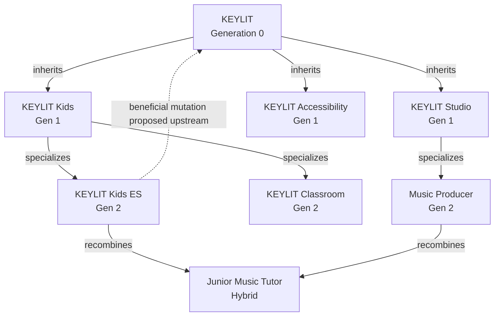
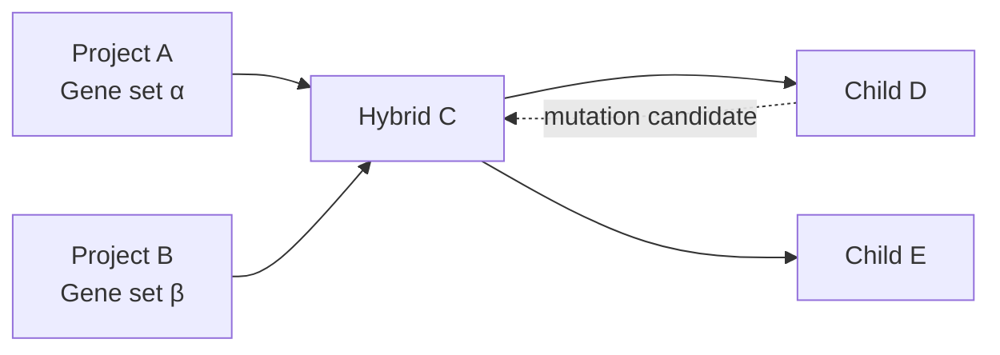
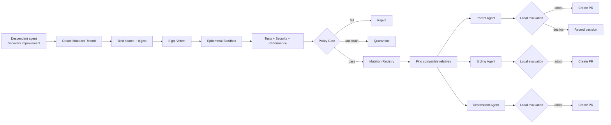
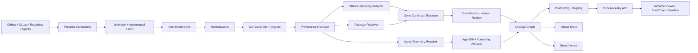
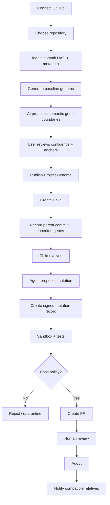

# CodeAncestry.com: Designing a Living Software Genome Registry Inspired by Genetics, Genomics, and Evolutionary Visualization

## Executive summary

CodeAncestry began with a deceptively simple software question: **what if a child project could remain connected to its parent instead of becoming an isolated fork?** In the KEYLIT thought experiment, a parent application could produce specialized children—KEYLIT Kids, KEYLIT Classroom, KEYLIT Accessibility—and those descendants could continue inheriting improvements selectively. The idea then changed fundamentally when we added an **agent to every generation**. At that point, the lineage was no longer only a history of repositories: every project could carry a machine-readable “genome,” every capability could have ancestry, every mutation could have evidence, and every project agent could exchange useful discoveries with relatives.

The strongest version of CodeAncestry is therefore **not a Git visualization site and not another code host**. It is a proposed semantic lineage layer above Git, software registries, CI/CD systems, and AI agents:

```text
Git / GitHub / GitLab / registries
              │
              ▼
      immutable artifacts
              │
              ▼
      CODEANCESTRY LAYER
              │
     ┌────────┼─────────┐
     │        │         │
  Projects   Genes    Agents
     │        │         │
     └──── Knowledge ───┘
              │
          Evidence
              │
       Tests / Attestations
```

The genetics analogy is unusually productive because contemporary genomic systems already solve several UX problems that CodeAncestry will encounter. NCBI, Ensembl and the UCSC Genome Browser provide multi-scale exploration of enormous, densely annotated spaces; UniProt and NCBI provide stable, evidence-rich entity records; Gene Ontology provides formal concepts, relationships and evidence-driven filtering; 23andMe translates complicated ancestry data into approachable family and chromosome visualizations; the Human Genome Project provides a model for historical timelines and open scientific infrastructure; and Google DeepMind demonstrates how complex molecular science can be communicated through emotionally compelling, high-quality three-dimensional visual storytelling. citeturn14search1turn14search17turn15search20turn15search3turn15search1turn15search2turn14search0

My central design recommendation is to **combine those traditions instead of imitating any single genetics site**:

> **DeepMind for the first 15 seconds.  
> 23andMe for comprehension.  
> UCSC/Ensembl for exploration.  
> UniProt/NCBI for records.  
> Gene Ontology for semantics.  
> GitHub for developer workflow.  
> SLSA/in-toto for trust.**

The public homepage should feel almost cinematic: a slowly rotating software double helix whose “bases” are capabilities, commits, agents, tests and artifacts. As the visitor scrolls, the helix should unfold into a branching CodeTree. One descendant discovers a mutation; a pulse moves through a lineage edge; other projects test it; some adopt it. This explains the entire vision without a paragraph of documentation. Three.js is the appropriate first choice for the hero, while D3 is better for the actual analytical lineage interfaces. D3 already supplies hierarchy, force-layout and zoom primitives; deck.gl should be reserved for genuinely large GPU-rendered graphs rather than introduced in the MVP merely because it is powerful. citeturn20search0turn20search5turn20search8turn20search1turn20search2

Inside the product, the visual metaphor must become more scientific and less cinematic. A **Project Genome Viewer** should use horizontally aligned “tracks,” analogous to a genome browser: genes/capabilities, dependencies, commits, agent activity, security findings, mutations, tests, releases and deployments aligned along a shared temporal or version axis. UCSC’s browser is a particularly strong precedent because it supports navigation across genomic scales while allowing built-in, custom and remotely hosted tracks to coexist. citeturn15search20turn15search8turn15search24

CodeAncestry's fundamental object should be a **semantic capability called a Gene**, not a source file. A gene might be “MIDI input handling,” “authentication,” “PDF export,” “vector search,” or “adaptive lesson scoring.” It is connected to concrete code through immutable **anchors**: repository, commit digest, path, symbol, package, tests and artifacts. AI may infer those semantic boundaries, but inferred genes must carry confidence scores and remain human-correctable. This distinction is essential: pretending that a function or file is literally equivalent to a biological gene would make the metaphor visually attractive but technically weak.

The proposed graph should contain at least these entities:

```text
ProjectGenome
Gene
GeneVersion
Mutation
LineageEdge
AgentDNA
LearningArtifact
FitnessEvaluation
SandboxRun
Artifact
Attestation
ExternalIdentity
```

A mutation should **never automatically spread because a related agent recommends it**. The biological metaphor should stop where software safety begins. The propagation protocol should instead be:

```text
Discover
   ↓
Describe
   ↓
Sign / attest
   ↓
Sandbox
   ↓
Test
   ↓
Evaluate fitness
   ↓
Policy decision
   ↓
Adopt / Reject / Quarantine
   ↓
Optionally notify relatives
```

This aligns naturally with existing provenance infrastructure. W3C PROV defines provenance around entities, activities and agents; SLSA defines verifiable provenance describing where, when and how software artifacts were produced; and in-toto defines signed statements that bind immutable subjects to predicates such as build or test information. CodeAncestry should build **on top of those concepts**, not invent a proprietary trust format from scratch. citeturn21search2turn21search0turn21search13turn21search6turn21search8

There is also an important overlap to acknowledge rigorously: **CycloneDX already has the concept of component pedigree**, including information about the origin and modifications of software components. Therefore CodeAncestry's defensible contribution is not merely “software can have ancestry.” The distinctive proposition is the combination of **semantic capability lineage, project reproduction, agent identity/inheritance, mutation evaluation, bidirectional knowledge propagation and human-facing evolutionary visualization**. citeturn11search3

The initial twelve-week MVP should be dramatically narrower than the ultimate vision:

**GitHub → generate genome → inspect genes → see ancestry → create child relationship → propose mutation → run sandbox tests → produce signed evidence → adopt or reject.**

Do **not** attempt autonomous global agent learning, every Git host, a separate graph database, marketplace economics, robotic ancestry, or automatic cross-family mutation propagation in the first release.

For the domain, the `.com` you already acquired should unequivocally be canonical:

| Domain | Strategic role | Recommendation |
|---|---|---|
| **codeancestry.com** | Company, product, protocol and registry | **Canonical. Use everywhere.** |
| codeancestry.io | Developer-oriented defensive redirect | Buy later only if inexpensive |
| codeancestry.codes | Memorable campaign/experimental redirect | Nice but nonessential |
| codeancestry.dev | Documentation/SDK alternative | Optional |
| codeancestry.ai | Emphasizes agents but narrows perception of the project | Optional; not canonical |

IANA's Root Zone Database is the authoritative directory of delegated top-level domains and distinguishes generic TLDs from country-code TLDs. The `.com` address avoids binding the company identity specifically to AI, coding, or one country-code namespace, which is valuable because the long-term thesis extends beyond an AI coding tool. citeturn13search2

The assumptions behind this report are intentionally explicit: the budget has not been specified; expected repository and graph scale is unknown; enterprise compliance requirements and geographic data-residency requirements are unknown; access to proprietary Codex/Claude/Cursor/Grok logs cannot be assumed; and the size of the engineering team has not been defined. Therefore the recommended architecture favors **open formats, reversible infrastructure decisions and a GitHub-first MVP** rather than premature scaling.

## Inspiration from genomics interfaces

The most useful genetics inspiration is not “make the website look like DNA.” It is to study how genomics products expose **identity, ancestry, scale, uncertainty, evidence and relationships**.

**Google DeepMind: science as visual storytelling.** DeepMind's AlphaGenome work predicts how variants in DNA influence biological processes regulating genes, while AlphaMissense addresses missense-variant effects and AlphaFold made complex three-dimensional molecular structures visually understandable to a broad audience. DeepMind's current science pages repeatedly use abstract molecular forms, high-quality three-dimensional compositions, generous whitespace and motion as explanatory rather than merely decorative elements. citeturn14search0turn14search20turn14search28turn14search12

That provides the inspiration for CodeAncestry's **marketing layer**. The homepage should not initially show a conventional Git graph. It should communicate:

> Software is alive with ancestry.  
> Capabilities survive generations.  
> Mutations can propagate.  
> Agents can exchange discoveries.

DeepMind's Enformer page is an especially good conceptual precedent because it uses an abstract DNA-helix motif while explaining a computational model connecting DNA sequence to gene expression. CodeAncestry can use the same visual grammar without copying the artwork: transform a recognizable double helix gradually into a software lineage graph. citeturn14search16

**NCBI: stable identity and authoritative records.** NCBI Gene combines nomenclature, reference sequences, maps, pathways, variations, phenotypes and cross-links in individual gene records. GenBank acts as a public sequence repository, while RefSeq provides an integrated, annotated, non-redundant reference collection. These are powerful precedents for assigning stable CodeAncestry IDs and exposing one canonical page containing a gene's function, versions, provenance, evidence, mutations, relationships and external references. citeturn14search17turn14search9turn14search5

A CodeAncestry entity should therefore feel like a registry accession:

```text
CA-GENE-7T4K92
Adaptive MIDI Buffering

Origin
KEYLIT

First observed
2026-08-28

Current lineage
v1 → v1.1 → v1.3 → v2

Confidence
Verified

Carried by
1,842 project genomes

Evidence
42 test attestations
17 compatibility evaluations
3 security reviews

External anchors
GitHub commits
npm packages
OCI images
SLSA provenance
```

**NCBI Genome Data Viewer, Ensembl and UCSC: multi-scale exploration.** NCBI's Genome Data Viewer currently supports exploration of thousands of eukaryotic assemblies; Ensembl provides genome browsing, variation and programmatic REST access; UCSC's Genome Browser combines navigation controls, chromosome position, annotation tracks and user-configurable track displays. UCSC additionally allows custom tracks and track hubs, making external datasets appear alongside native annotations. citeturn14search1turn14search6turn15search20turn15search8turn15search24

That suggests one of CodeAncestry's strongest screens: **the Software Genome Browser**.

```text
KEYLIT • Genome @ 8f31d29

Version     v1.0        v1.1      v1.2        v2.0
            │           │         │           │
Genes       ████████████████████████████████████
MIDI        ████████████████░░░█████████████████
Lessons     █████████████████████████████████████
Agents      ───────●────────●──────●──────●──────
Mutations       ▲ M12          ▲ M18     ▲ M23
Tests       ✓✓✓✓✓✓✓✓✓✓✓✓✓✓✓✓✓✓✓✓✓✓✓✓✓✓✓✓✓✓✓
Security        │             ⚠ fixed
Releases    ●──────────●─────────────●──────────●
Children              └── Kids
                               └── Kids ES
```

The crucial lesson is **semantic zoom**. At maximum zoom-out, the user sees project families. Zoom closer and projects resolve into genes. Zoom further and a gene resolves into versions and mutations. At the deepest level, a mutation resolves into code symbols, commits, tests and artifacts. D3's zoom primitives support mouse, touch and programmatic transitions, while its hierarchy layouts support Cartesian and polar tree forms. citeturn20search1turn20search8

**UniProt: dense evidence without losing identity.** UniProt's central value for our design is the organization of sequence and functional information around a recognizable biological entity. CodeAncestry's Gene Detail page should similarly make the primary identity immediately obvious, with evidence and technical detail progressively disclosed rather than forcing the user into raw Git history. citeturn14search3turn14search7

**Gene Ontology: semantics over filenames.** GO describes biological concepts through a structured ontology whose terms are connected by formally defined relations, and AmiGO exposes faceted filtering by properties such as species, ontology aspect and evidence. The GO Ribbon additionally provides a compact visual summary of a gene's functions. citeturn15search7turn15search15turn15search39

That is probably the most important conceptual precedent for defining software genes. CodeAncestry eventually needs a lightweight **Software Capability Ontology**:

```text
software capability
│
├── input
│   ├── keyboard input
│   ├── MIDI input
│   └── voice input
│
├── persistence
│   ├── SQL storage
│   └── object storage
│
├── intelligence
│   ├── retrieval
│   ├── generation
│   └── planning
│
└── interface
    ├── visualization
    └── accessibility
```

The ontology would allow two separately implemented capabilities to be recognized as related even when their filenames, programming languages and package structures differ. As with Gene Ontology, the objective should be machine-readable semantics with human-readable labels rather than one giant taxonomy hard-coded into the UI. citeturn15search3turn15search7

**23andMe: make ancestry emotionally understandable.** Chromosome Painting represents segments of a person's chromosome pairs using ancestry categories, allows the user to hover or click segments, and exposes confidence controls that make uncertainty visible rather than hiding it. 23andMe also connects ancestry information to family-oriented exploration. citeturn15search1turn15search5turn15search13

CodeAncestry should steal the **interaction principle**, not the biological claims. A Project Genome could have a “Code Painting”:

```text
KEYLIT Kids

████████████████████████████████  KEYLIT Core
██████                            Kids branch
███                               Accessibility branch
██                                Local mutations
```

Hovering a segment could reveal:

```text
Adaptive Lesson Engine
68% inherited from KEYLIT
21% evolved in KEYLIT Kids
11% modified locally

Evidence confidence: 0.93
```

An even better adaptation of 23andMe's confidence controls would be an **Evidence Threshold** slider:

```text
Evidence

Inferred ───────── Reviewed ───────── Verified
     ◉
```

Move it toward **Verified**, and speculative AI-inferred gene boundaries and uncertain parent relationships disappear. This would make uncertainty a first-class interaction instead of burying “AI confidence” inside metadata. The idea is directly inspired by 23andMe's ability to adjust confidence in ancestry assignments. citeturn15search13turn15search21

**The Human Genome Project: history as an explorable narrative.** NHGRI provides interactive timelines for the Human Genome Project and the broader history of genetics; the HGP itself ran from 1990 to 2003 and became associated with large-scale international collaboration and data sharing. citeturn15search2turn15search22

CodeAncestry should therefore provide two timeline modes:

```text
PROJECT TIME
KEYLIT
2026 ───── v1 ───── Kids ───── Classroom ───── Robot branch

GENE TIME
Adaptive Learning
2026 ─ original ─ M12 ─ M47 ─ M83 ─ hybridized ─ M191
```

For visual assets, NHGRI also maintains a genomics image gallery and notes that its imagery is generally public domain unless otherwise stated. That can provide scientifically authentic reference material during visual research, although original CodeAncestry artwork should ultimately be created so the company develops a distinctive identity. citeturn15search14

The synthesis is:

| Genetics precedent | Pattern to borrow | CodeAncestry equivalent |
|---|---|---|
| DeepMind AlphaGenome/AlphaFold | Immersive molecular storytelling | Animated software DNA hero |
| NCBI Gene / UniProt | Stable accession + evidence-rich detail page | Gene Registry |
| NCBI GDV / UCSC / Ensembl | Pan, zoom, tracks, multi-scale navigation | Project Genome Browser |
| UCSC Track Hubs | User-supplied annotation layers | Security, agent, CI and registry tracks |
| 23andMe Chromosome Painting | Familiar ancestry composition | Code Painting |
| 23andMe confidence controls | Explicit uncertainty | Evidence Threshold |
| Gene Ontology / AmiGO | Semantic ontology + facets | Capability ontology |
| Human Genome Project | Historical timeline | Project/Gene evolutionary timeline |

The design thesis is consequently **not “GitHub with DNA graphics.”** It is a scientific-information architecture wrapped in an emotionally understandable ancestry metaphor.

## Product UX and visualization system

The site should have two personalities.

The **public experience** should be beautiful, narrative and approachable. The **registry/product experience** should be dense, precise, inspectable and evidence-oriented. Mixing those modes everywhere would create a site that is spectacular for ten minutes and exhausting for daily work.

The recommended primary information architecture is:

```text
codeancestry.com
│
├── Home
├── Explore
│   ├── Projects
│   ├── Genes
│   ├── Agents
│   └── Mutations
│
├── Registry
│   ├── Project Genome
│   ├── Gene Detail
│   ├── Agent Profile
│   └── Mutation Detail
│
├── Sandbox
├── Docs
├── Research
└── App
```

The core UI components should be these:

| Component | Primary question it answers | Principal visualization |
|---|---|---|
| **Landing page** | “What is CodeAncestry?” | 3D DNA → CodeTree transition |
| **Registry** | “What exists and how do I find it?” | Search + faceted cards |
| **Project Genome Viewer** | “What is this application made from?” | Genome tracks + Code Painting |
| **Family CodeTree** | “Who descended from whom?” | Force/tree/radial lineage graph |
| **Gene Detail** | “What is this capability and where did it come from?” | Version lineage + evidence |
| **Agent Profile** | “Which agent contributed or learned what?” | Capability/evidence graph |
| **Mutation Card** | “What changed and is it beneficial?” | Before/after + fitness vector |
| **Sandbox/Test Console** | “Is this mutation safe for my project?” | Test pipeline + logs + attestations |
| **Timeline** | “How did this evolve?” | Zoomable chronological history |

The **Registry** should behave closer to UniProt/AmiGO than GitHub search. A query for “MIDI buffering” should produce genes, projects, mutations and agents as separate entity types. Facets should include language, ecosystem, license, verification level, project family, source host, fitness evidence and creation date. GO's combination of ontology search and evidence filtering is the conceptual model. citeturn15search15

The **Project Genome Viewer** is the signature logged-in product. It should place several synchronized tracks on a common axis:

```text
┌──────────────────────────────────────────────────────────────┐
│ KEYLIT Genome                 commit: 82c1...   Gen: 0       │
├──────────────────────────────────────────────────────────────┤
│ Capability genes  ███████████████████████████████████████    │
│ Dependencies      ─●──────●──●─────────●──────────●──────     │
│ Mutations             ▲          ▲             ▲              │
│ Agent activity     ●────●──────●────────●────●                 │
│ Tests             ✓✓✓✓✓✓✓✓✓✓✓✓✓✓✓✓✓✓✓✓                         │
│ Security                     ⚠→✓                               │
│ Releases          ●──────────●──────────────●                  │
│ Children                     ├─ KEYLIT Kids                   │
│                              └─ KEYLIT Classroom              │
└──────────────────────────────────────────────────────────────┘
```

UCSC demonstrates why track-based interfaces work for dense lineage information: a shared coordinate system allows many annotations to be compared without forcing them into one graph. Its distinction between built-in tracks, custom tracks and track hubs maps naturally to CodeAncestry's future extension model. citeturn15search20turn15search16turn15search36

The **family CodeTree** should support several layouts rather than pretending one visualization works at every scale.



For small families, use a tidy tree. For highly interconnected families, use a force-directed graph. For a large single-root lineage, offer a radial tree or sunburst. D3's hierarchy package directly supports tree, dendrogram, polar and enclosure layouts, while `d3-force` supports interactive network and hierarchy simulation. citeturn20search8turn20search5

A **Sankey-style view** is appropriate when the user's question changes from *who descended from whom?* to *where did capabilities flow?*

```text
KEYLIT Core ───────────────┐
MIDI Package ────────┐     ├── KEYLIT Kids
                     ├─────┤
Gamification Gene ───┘     └── Classroom
                                 │
Accessibility Gene ──────────────┘
```

An **arc diagram** is better for long-range mutation propagation across an ordered timeline because it preserves chronology while showing cross-generational relationships. Neither Sankey nor arc views should be the default genealogy—they answer different questions.

The **Mutation Card** should be a compact scientific result rather than a Git diff summary:

```text
MUTATION M-83F12
Adaptive MIDI buffering

Origin
KEYLIT Kids / Gen 4

Changes
2 symbols • 1 test suite • 0 API breaks

Evidence
✓ 214 tests
✓ Chrome
✓ Safari
✓ Firefox
✓ security policy

Fitness change
Latency        -22 ms
CPU            -6%
Compatibility   no regression
Correctness     unchanged

Confidence
0.97

Status
Candidate for family propagation
```

“Fitness” should never be a single magic score. A mutation that reduces latency but increases memory, or improves completion rate while harming accessibility, has trade-offs. Store and display a **fitness vector**:

\[
F(m,e)=
\left[
C,\,
S,\,
P,\,
K,\,
M,\,
U
\right]
\]

where, for example, \(C\) is correctness evidence, \(S\) security, \(P\) performance, \(K\) compatibility, \(M\) maintainability and \(U\) user-outcome evidence in environment \(e\). This is a proposed CodeAncestry model, not a biological equivalence. Any aggregate score should be an optional policy-specific view rather than the canonical truth.

The **Agent Profile** should deliberately avoid pretending that CodeAncestry owns another provider's model internals:

```text
AGENT CA-A-29FD

Provider-reported identity
Codex / external

Project
KEYLIT Kids

Capabilities
code-edit
test
architecture
GitHub PR
MCP tools

Authorized memory
23 lineage summaries
8 accepted mutations
3 rejected mutations

Knowledge produced
M-83F12
M-91D04

Trust
Identity: verified
Outputs: signed
Private reasoning: not stored
```

The distinction between **Agent DNA** and model weights matters. CodeAncestry should record public/configurable identity, tools, capabilities, policies, lineage, authorized memories and signed outputs—not attempt to extract proprietary training data, hidden reasoning or model weights.

MCP is now an open protocol for connecting LLM applications to external systems and tools, while A2A was designed as a protocol for collaboration between agents regardless of framework or vendor and was moved under Linux Foundation governance. A2A agent cards are an especially relevant precedent for machine-readable agent capability profiles. citeturn19search0turn19search16turn19search5turn19search1turn19search11

That suggests a future mapping:

```text
A2A Agent Card
       │
       ▼
CodeAncestry AgentDNA
       │
       ├── ancestry
       ├── project relationship
       ├── signed mutations
       ├── learning artifacts
       └── evidence history

MCP tools
       │
       └── exposed capabilities
```

The **visualization stack** should be chosen by task, not branding enthusiasm:

| Technology | Strength | CodeAncestry use | MVP priority |
|---|---|---|---|
| **Three.js** | Three-dimensional browser scenes using WebGL/WebGPU-oriented rendering APIs | Homepage DNA, optional 3D lineage mode | **High for hero** citeturn20search0turn20search4 |
| **D3** | Highly flexible data-driven visualization; hierarchy, force and zoom modules | Family tree, radial tree, timeline, genome tracks | **Critical** citeturn20search14turn20search8turn20search5turn20search1 |
| **deck.gl** | GPU-oriented visualization of large datasets with picking and layered rendering | Huge registries/graphs, dense arcs, later analytics | **Later** citeturn20search2turn20search15 |
| **Lottie** | JSON-exported After Effects animations rendered on web/mobile | Empty states, onboarding, small explanatory sequences | Optional citeturn20search3 |
| **CSS/Web Animations** | Lightweight state and micro-interaction animation | Hover, filtering, cards, transitions | **Critical** |
| **Custom shaders** | Data-driven GPU effects | Mutation pulses, confidence glow, helix distortion | Limited hero use |

A particularly useful motion vocabulary would be consistent throughout the product:

```text
Slow rotation       = living system / idle
Pulse along edge    = information transmitted
Branch growing      = child creation
Node division       = project reproduction
Locus highlight     = selected gene
Faint node          = inferred / weak evidence
Solid node          = verified
Dashed edge         = proposed relation
Edge glow           = active propagation
Frozen edge         = quarantined
```

Motion thereby becomes **semantic** instead of decoration.

## CodeAncestry data and protocol model

Biology gives us useful vocabulary, but the internal specification must be explicit about what the metaphors mean.

| Genetics concept | CodeAncestry meaning | Important qualification |
|---|---|---|
| **Genome** | Versioned manifest of a project's capabilities and lineage | Not simply the repository |
| **Gene** | Stable semantic capability | Not automatically a file/function |
| **Gene version** | Specific implementation/evolutionary state | Anchored to immutable source |
| **Variant / allele** | Alternative implementation of a gene | “Variant” is clearer UI language |
| **Mutation** | Proposed or observed change to one or more genes | Requires evidence |
| **Inheritance** | Child references an ancestor's gene version | May pin, follow or diverge |
| **Expression** | Capability enabled/configured in a project | Runtime/environment-dependent |
| **Genotype** | Project's declared gene composition | Structural description |
| **Phenotype** | Measured runtime/user-visible behavior | Observational, not source truth |
| **Recombination** | Child derives material from multiple parents | Software “mashup” |
| **Lineage** | Typed derivation graph | Can be DAG, not only tree |
| **Fitness** | Context-specific evidence vector | Never universal biological fitness |
| **Agent DNA** | Agent identity, policy, capability and authorized memory profile | Not model weights |
| **Learning artifact** | Portable lesson/test/fix/observation | Explicitly transferable data |
| **Epigenetic-like state** | Environment, feature flags, config | Metaphor only |

The core database is therefore a **property graph expressed initially in relational tables**:

```text
ProjectGenome ──INHERITS──────▶ GeneVersion
      │                             │
      │                             ├──MUTATES──▶ GeneVersion
      │                             │
      │                             └──EVIDENCED_BY──▶ Attestation
      │
      ├──DERIVED_FROM───────▶ ProjectGenome
      │
      ├──USES───────────────▶ AgentDNA
      │
      └──OBSERVED_IN────────▶ SandboxRun

Mutation ──PROPOSED_BY───────▶ AgentDNA
Mutation ──EVALUATED_BY──────▶ FitnessEvaluation
AgentDNA ──PRODUCED──────────▶ LearningArtifact
LearningArtifact ──OFFERED_TO▶ Related ProjectGenome
```

The **project graph should be a DAG rather than a strict tree**, because hybrids can have multiple parents:



Every important edge should contain evidence:

```json
{
  "type": "derived_from",
  "from": "ca:project:keylit-kids",
  "to": "ca:project:keylit",
  "source": {
    "provider": "github",
    "parentCommit": "82c134...",
    "childInitialCommit": "117ad2..."
  },
  "assertion": "verified",
  "attestation": "sha256:..."
}
```

This is where W3C PROV's separation between entities, activities and agents becomes useful conceptually, while in-toto's subject-plus-digest model provides a strong pattern for binding claims to immutable artifacts. citeturn21search2turn21search6

The canonical repository-level file should be **`genome.json`**:

```json
{
  "$schema": "https://codeancestry.com/schemas/genome/v0.1.json",
  "schemaVersion": "0.1",
  "id": "ca:project:01JKEYLIT000000000000000",
  "name": "KEYLIT",
  "visibility": "public",

  "source": {
    "provider": "github",
    "repository": "uset82/keylit",
    "commit": "82c134bd1f...",
    "digest": "sha256:..."
  },

  "parents": [],

  "genes": [
    {
      "id": "ca:gene:midi-input",
      "version": "1.2.0",
      "digest": "sha256:...",
      "expression": "active",
      "inheritance": "native",
      "confidence": 0.98,
      "anchors": [
        {
          "commit": "82c134bd1f...",
          "path": "src/midi/input.ts",
          "symbol": "MidiInputManager"
        }
      ]
    }
  ],

  "agents": [
    "ca:agent:01JAGENT000000000000001"
  ],

  "attestations": [
    {
      "type": "slsa-provenance",
      "digest": "sha256:..."
    }
  ],

  "privacy": {
    "registryVisibility": "public",
    "sourceVisibility": "inherit-provider",
    "agentTelemetry": "metadata-only"
  }
}
```

A child could explicitly express inheritance:

```json
{
  "id": "ca:project:keylit-kids",
  "name": "KEYLIT Kids",

  "parents": [
    {
      "project": "ca:project:keylit",
      "relationship": "child",
      "bornFromCommit": "82c134bd1f..."
    }
  ],

  "genes": [
    {
      "id": "ca:gene:midi-input",
      "version": "1.2.0",
      "inheritance": "inherited",
      "origin": "ca:project:keylit"
    },
    {
      "id": "ca:gene:gamification",
      "version": "1.0.0",
      "inheritance": "local",
      "origin": "ca:project:keylit-kids"
    }
  ]
}
```

A **`gene.json`** prototype should describe semantics separately from implementation:

```json
{
  "$schema": "https://codeancestry.com/schemas/gene/v0.1.json",
  "schemaVersion": "0.1",

  "id": "ca:gene:adaptive-midi-buffer",
  "name": "Adaptive MIDI Buffer",
  "description": "Adjusts buffering strategy to reduce input latency.",

  "ontology": {
    "class": "input.midi.latency-management",
    "tags": [
      "midi",
      "audio",
      "latency"
    ]
  },

  "currentVersion": "2.1.0",

  "versions": [
    {
      "version": "2.1.0",
      "digest": "sha256:...",
      "parents": [
        "ca:gene:adaptive-midi-buffer@2.0.0"
      ],
      "implementation": {
        "language": "typescript",
        "anchors": [
          {
            "repository": "github:example/keylit",
            "commit": "82c134...",
            "path": "src/midi/buffer.ts",
            "symbols": [
              "AdaptiveBuffer"
            ]
          }
        ]
      },
      "interfaces": {
        "inputs": ["midi-event"],
        "outputs": ["scheduled-note-event"]
      },
      "tests": [
        "ca:test:midi-latency-suite-v3"
      ]
    }
  ],

  "origin": {
    "project": "ca:project:keylit",
    "firstObservedCommit": "27ad90..."
  },

  "license": {
    "spdx": "MIT"
  },

  "confidence": {
    "semanticBoundary": 0.94,
    "origin": 1.0
  }
}
```

The **`agent-dna.json`** prototype should intentionally contain portable, consented information rather than private model cognition:

```json
{
  "$schema": "https://codeancestry.com/schemas/agent-dna/v0.1.json",
  "schemaVersion": "0.1",

  "id": "ca:agent:01JAGENT000000000000001",
  "displayName": "KEYLIT Genome Agent",

  "identity": {
    "provider": "external",
    "providerAgentId": "optional",
    "verification": "self-declared"
  },

  "project": "ca:project:keylit",

  "capabilities": [
    "analyze-code",
    "propose-mutation",
    "run-tests",
    "review-lineage"
  ],

  "interfaces": {
    "mcp": true,
    "a2a": false
  },

  "tools": [
    {
      "name": "github",
      "scope": "repository"
    },
    {
      "name": "sandbox",
      "scope": "test-only"
    }
  ],

  "policies": {
    "canAutoMerge": false,
    "canPropagateMutations": false,
    "requiresHumanApproval": true
  },

  "authorizedMemory": {
    "mode": "summaries-only",
    "artifacts": [
      "ca:learning:47ac..."
    ]
  },

  "telemetry": {
    "capturePrompts": false,
    "captureCompletions": false,
    "captureToolMetadata": true,
    "captureTokenMetrics": true
  },

  "signingIdentity": {
    "type": "oidc",
    "issuer": "configured-at-runtime"
  }
}
```

OpenTelemetry's current GenAI work is directly relevant because its semantic conventions can represent model identity, token information and tool activity, and its documentation explicitly discusses recording full prompt/completion/tool content when opted in. For CodeAncestry, that argues for **metadata-only by default**, with full conversational content requiring explicit user or organization consent. citeturn19search10turn19search22turn19search26

The schema files themselves should be validated with JSON Schema Draft 2020-12, which remains the current published JSON Schema meta-schema. citeturn13search3turn13search6

A compact schema fragment for a Gene could look like:

```json
{
  "$schema": "https://json-schema.org/draft/2020-12/schema",
  "$id": "https://codeancestry.com/schemas/gene/v0.1.json",
  "title": "CodeAncestry Gene",
  "type": "object",
  "required": [
    "id",
    "name",
    "currentVersion",
    "versions"
  ],
  "properties": {
    "id": {
      "type": "string",
      "pattern": "^ca:gene:"
    },
    "name": {
      "type": "string",
      "minLength": 1
    },
    "description": {
      "type": "string"
    },
    "currentVersion": {
      "type": "string"
    },
    "versions": {
      "type": "array",
      "minItems": 1,
      "items": {
        "$ref": "#/$defs/geneVersion"
      }
    }
  },
  "$defs": {
    "geneVersion": {
      "type": "object",
      "required": [
        "version",
        "digest"
      ],
      "properties": {
        "version": {
          "type": "string"
        },
        "digest": {
          "type": "string",
          "pattern": "^sha256:"
        },
        "parents": {
          "type": "array",
          "items": {
            "type": "string"
          }
        }
      }
    }
  }
}
```

A mutation needs a distinct state machine:

```text
observed
   ↓
proposed
   ↓
sandboxing
   ↓
evaluated
   ↓
┌────────────┬─────────────┬─────────────┐
│ accepted   │ rejected    │ quarantined │
└────┬───────┴─────────────┴─────────────┘
     ↓
eligible-for-propagation
     ↓
offered-to-relatives
     ↓
independently evaluated
```

The **mutation propagation flow** is the heart of the agent-DNA concept:



The key architectural principle is:

> **Connected does not mean synchronized.**

An ancestor and descendant can exchange knowledge while retaining independent policy. That preserves project sovereignty and prevents one compromised agent or bad mutation from becoming a worm propagating through the family tree.

The portable object agents actually exchange should therefore be a **Learning Artifact**, not arbitrary memory:

```json
{
  "id": "ca:learning:47ac91",
  "kind": "engineering-observation",

  "origin": {
    "project": "ca:project:keylit-kids",
    "agent": "ca:agent:29fd",
    "mutation": "ca:mutation:83f12"
  },

  "claim": {
    "summary": "Adaptive buffering reduced median MIDI latency.",
    "scope": "browser-midi-input",
    "conditions": {
      "browserFamilies": [
        "chromium",
        "webkit"
      ]
    }
  },

  "evidence": [
    {
      "type": "test-result",
      "digest": "sha256:..."
    }
  ],

  "recommendedAction": "evaluate",

  "privacy": "public",
  "signature": "..."
}
```

That makes “agents learning from each other” concrete and auditable. It can mean **receiving a signed engineering observation, test, patch or strategy and incorporating it into future decisions** without implying that proprietary model weights are literally retrained whenever one project changes.

## Integrations, ingestion, and backend architecture

The integration strategy should follow a strict principle:

> **CodeAncestry should normalize provenance; it should not become another source-code silo.**

GitHub, GitLab, Bitbucket, Gitee, GitCode and Codeberg continue owning repository state. npm and PyPI continue publishing packages. OCI registries continue distributing container artifacts. AI platforms continue running their agents. CodeAncestry stores references, normalized identities, semantic genes, lineage edges, evidence and authorized observations.

GitHub should be the first full integration because its REST API exposes repositories, commits, repository content and pull requests, and GitHub Apps can receive webhook events. GitHub itself recommends webhooks over polling for integrations because they reduce unnecessary requests and help avoid rate-limit pressure. citeturn16search8turn16search4turn16search12turn16search0turn13search5turn13search20

GitLab exposes projects, repositories and commits through its REST API; Bitbucket Cloud exposes repository and pull-request APIs; Codeberg is powered by Forgejo and supports repository webhooks; Gitee provides API-backed repository/issue/pull-request integration and even offers an MCP server; and GitCode publishes REST API and OAuth documentation. citeturn16search9turn16search5turn16search1turn16search10turn16search2turn16search35turn16search3turn17search0turn18search1turn18search5

Package registries add another lineage dimension. npm packages consist of software plus package metadata; PyPI exposes JSON/index APIs and now an Integrity API concerned with provenance objects and attestations; the OCI Distribution Specification standardizes the API protocol used to distribute OCI content. citeturn17search3turn18search10turn18search2turn18search19turn18search3

A practical priority matrix is:

| Integration | Priority | Initial information to ingest | Why it matters |
|---|---:|---|---|
| **GitHub** | **P0** | repositories, commits, branches, PRs, forks, releases, checks, webhooks | First complete project-lineage workflow citeturn16search8turn16search4turn16search0 |
| **Generic Git** | **P0** | commit DAG, tags, remotes | Provider-independent foundation |
| **npm** | **P0** | name/version, dependencies, license, dist metadata | JavaScript/TypeScript gene/package anchors citeturn17search3turn17search8 |
| **PyPI** | **P0/P1** | project releases, files, provenance | Python lineage and existing attestations citeturn18search10turn18search2 |
| **OCI registries** | **P1** | manifests, digests, tags, artifact relationships | Deployment/artifact lineage citeturn18search3 |
| **GitLab** | **P1** | projects, commits, repositories, MRs | Second major forge adapter citeturn16search9turn16search1 |
| **Bitbucket Cloud** | **P1** | repositories, commits, pull requests | Enterprise/dev-team coverage citeturn16search10turn16search2 |
| **OpenTelemetry GenAI** | **P1** | agent/model/tool telemetry | Vendor-neutral agent observation format citeturn19search10turn19search22 |
| **MCP** | **P1** | tool capabilities and authorized interactions | Connect CodeAncestry tools to agents citeturn19search0turn19search16 |
| **A2A** | **P1/P2** | agent cards/capabilities and agent communication | Agent-to-agent lineage network citeturn19search5turn19search11 |
| **Codeberg / Forgejo** | **P2** | repository lineage + webhooks | Open forge ecosystem citeturn16search35turn16search3 |
| **Gitee** | **P2** | repositories, PRs, issues, webhooks | China-facing forge support; MCP already exists citeturn17search0 |
| **GitCode** | **P2** | repositories, commits, OAuth | Additional China-facing forge integration citeturn18search1turn18search5 |

This prioritization is based on **MVP usefulness and integration maturity**, not a claim about global market share.

The ingestion architecture should be event-driven:



The connector layer should never assume all APIs behave alike. It should expose an internal canonical event:

```ts
type SourceEvent = {
  provider: "github" | "gitlab" | "bitbucket" | "gitee" | "gitcode" | "codeberg";
  tenantId: string;
  repositoryId: string;
  eventType: string;
  providerEventId?: string;
  occurredAt: string;
  receivedAt: string;
  payloadDigest: string;
  cursor?: string;
  rawObjectRef: string;
};
```

Provider rate limits must be handled independently. GitHub, for example, documents separate primary limits for authentication modes and can apply secondary limits; its documentation explicitly recommends webhooks instead of polling. The correct general architecture is therefore **webhook-first, delta-fetch second, full rescan only when reconciliation detects inconsistency**. citeturn13search1turn13search11turn13search8

The pipeline should additionally implement:

```text
Per-provider token bucket
Exponential backoff
Retry-After handling
ETag / conditional requests
Idempotency by event ID + payload hash
Cursor checkpoints
Webhook replay detection
Dead-letter queue
Scheduled reconciliation
Provider health dashboard
```

PyPI's API documentation, for example, explicitly exposes caching information and ETags for repeated API access, reinforcing the value of conditional and cache-aware ingestion rather than brute-force polling. citeturn18search25

The database should begin with **PostgreSQL** rather than a graph database. A normalized relational core can represent projects, genes, versions, mutations, edges and attestations, while JSONB can hold provider-specific metadata. PostgreSQL already includes native full-text search and relevance ranking, with GIN/GiST indexing options. citeturn13search0turn13search4turn13search19

A workable initial schema:

```text
projects
project_versions
genes
gene_versions
project_genes
lineage_edges
mutations
mutation_gene_edges
agents
agent_project_edges
learning_artifacts
fitness_evaluations
sandbox_runs
attestations
external_identities
provider_events
```

The edge table might be:

```sql
lineage_edges (
    id,
    source_entity_type,
    source_entity_id,
    relation,
    target_entity_type,
    target_entity_id,
    confidence,
    assertion_level,
    evidence_digest,
    created_at
)
```

That gives CodeAncestry a graph without committing its entire infrastructure to Neo4j on day one. A dedicated graph database can be introduced later if deep traversals, path analytics and very large lineage exploration become demonstrable bottlenecks.

Search should similarly start in PostgreSQL:

```text
exact identifier search
        +
full-text search
        +
faceted SQL filters
        +
optional vector similarity later
```

This keeps a single source of truth during the MVP. The semantic query:

> “Find authentication genes related to OAuth that descend from Project X and have verified security evidence”

can initially combine ontology labels, PostgreSQL search and lineage joins. Specialized search infrastructure becomes justified only after real query data shows a need.

The backend service boundaries should be:

```text
Web/API
│
├── Identity & authorization
├── Registry API
├── Lineage API
├── Search API
└── Realtime status

Async workers
│
├── Provider ingestion
├── Repository analysis
├── Gene inference
├── Dependency resolution
├── Attestation verification
└── Fitness aggregation

Execution plane
│
└── Ephemeral sandbox containers
```

The **sandbox must be a separate security boundary**. Source repositories are untrusted. Generated code is untrusted. Agent-proposed patches are untrusted. A mutation evaluation should occur inside an ephemeral environment with:

```text
temporary filesystem
resource quotas
time limit
restricted network egress
no production credentials
scoped test credentials only
captured logs
artifact digests
reproducible test configuration
destroy-on-completion
```

The user flow from source repository to adopted mutation becomes:



The first “Create Child” function need not invent a new Git primitive. It can orchestrate ordinary repository creation/forking/template workflows and write the CodeAncestry lineage record that Git itself does not semantically capture.

## Trust, security, accessibility, and deployment

CodeAncestry's credibility will depend more on **what it refuses to claim** than on the elegance of its DNA animation.

Every important record should expose its epistemic status:

```text
OBSERVED
Directly obtained from repository/API.

DECLARED
Provided by project owner.

INFERRED
Generated from code analysis or AI.

REVIEWED
Accepted by an authorized human.

VERIFIED
Cryptographically/evidentially confirmed.
```

For example:

```text
Origin relationship       VERIFIED
Gene semantic boundary    INFERRED 0.87
License                    OBSERVED
Mutation performance       VERIFIED
Agent identity             DECLARED
Agent tool execution       VERIFIED
```

This is the equivalent of making evidence visible in scientific databases rather than flattening everything into a single “AI says so” result.

Provenance should be compatible with existing trust systems. W3C PROV provides a general interoperable provenance model; SLSA 1.2 describes software supply-chain security and provenance; in-toto's Statement format binds immutable subjects identified by digests to typed predicates, and its Test Result predicate can represent whether required tests ran and passed. citeturn21search2turn21search0turn21search6turn21search8

A CodeAncestry mutation attestation could conceptually fit inside an in-toto statement:

```json
{
  "_type": "https://in-toto.io/Statement/v1",

  "subject": [
    {
      "name": "ca:mutation:83f12",
      "digest": {
        "sha256": "..."
      }
    }
  ],

  "predicateType":
    "https://codeancestry.com/attestations/mutation-evaluation/v0.1",

  "predicate": {
    "sourceProject": "ca:project:keylit-kids",
    "sourceCommit": "82c134...",
    "sandbox": "ca:sandbox:91d...",
    "tests": {
      "passed": 214,
      "failed": 0
    },
    "fitness": {
      "latencyDeltaMs": -22,
      "cpuDeltaPercent": -6
    }
  }
}
```

CodeAncestry should also interoperate with CycloneDX/SPDX rather than replace software bills of materials. CycloneDX's existing pedigree concept is especially close to the ancestry metaphor, so CodeAncestry should be able to attach CycloneDX component identities and pedigree evidence to semantic genes. The new layer is the **meaning and evolutionary relationship of capabilities and agents**, not another duplicate SBOM. citeturn11search3turn11search1

The **security model** should enforce several hard boundaries:

| Risk | Required design response |
|---|---|
| Compromised Git provider token | Least-privilege GitHub App/OAuth scopes; encrypted credentials; rotation |
| Forged webhook | Verify provider signature/secret before ingestion |
| Replay event | Store provider event IDs/digests and reject duplicates |
| Malicious repository content | Treat every repository as untrusted input |
| Agent prompt injection from source | Separate data from agent instructions; explicit tool permission gates |
| Malicious mutation | No execution outside isolated sandbox |
| Mutation worm | No automatic cross-project adoption |
| Supply-chain tampering | Digest artifacts and require attestations |
| Secret leakage | Redact known secret classes; don't place secrets in lineage records |
| Private project exposure | Object-level authorization on every entity and edge |
| Sensitive agent conversations | Metadata-only default; content opt-in |
| Malicious visualization payload | Never render repository HTML/scripts directly |
| Cross-tenant leakage | Tenant-scoped queries, storage and authorization tests |

GitHub explicitly recommends configuring webhook secrets and validating webhook origin/authenticity. citeturn13search29

The most important **agent privacy rule** should be:

> CodeAncestry stores what an agent **did, asserted, tested and shared**, not a compulsory copy of everything it thought or everything the user said.

OpenTelemetry's GenAI instrumentation demonstrates that full prompt and completion capture is technically possible and can be disabled; that distinction should be reflected directly in CodeAncestry's privacy controls. citeturn19search10turn19search26

A privacy control could be:

```text
Agent telemetry

○ None
● Metadata only
○ Tool inputs/outputs
○ Conversation excerpts
○ Full authorized traces

Never collected:
private model weights
provider-internal reasoning
data unavailable through authorized interfaces
```

That last point matters strategically. CodeAncestry could eventually integrate **GitHub + Codex + Claude + Cursor + Grok + other agents**, but only to the extent that those products expose user-authorized APIs, files, events, telemetry or interoperability interfaces. The platform should be designed around a provider-neutral protocol instead of depending on privileged access that may never exist.

Accessibility is particularly important because the proposed website uses extensive motion and graphs. WCAG guidance states that interaction-triggered motion should be disable-able when it is not essential, and W3C explicitly documents `prefers-reduced-motion` as a mechanism for users who may experience distraction or nausea from animation. citeturn22search0turn22search4

Every visualization therefore needs a non-visual equivalent:

```text
3D ancestry hero
→ static SVG fallback

Force graph
→ keyboard-navigable tree/list

Genome tracks
→ structured table

Color-coded confidence
→ text + icon + pattern

Animated mutation pulse
→ status text

Drag-to-pan
→ buttons + keyboard navigation

Auto animation
→ Pause control + reduced-motion mode
```

For the family graph, screen readers should be able to access something like:

```text
KEYLIT, Generation 0
  Child: KEYLIT Kids, Generation 1
    Child: KEYLIT Kids ES, Generation 2
  Child: KEYLIT Studio, Generation 1
    Child: Music Producer, Generation 2
```

Color should never be the only encoding for inherited, mutated, inferred, quarantined or verified states.

For hosting, there are three reasonable choices rather than one objectively correct answer.

**Cloudflare** is strategically attractive because `codeancestry.com` is already managed there, and Workers provides a global application runtime. Cloudflare's August 2026 Next.js guidance currently recommends the `vinext` path for Workers but explicitly describes it as beta; Cloudflare also has a current React/Vite deployment path that avoids that specific beta dependency. citeturn22search1turn22search17

**Vercel** remains an obvious option for a conventional Next.js application and provides native Next.js-oriented deployment workflows, while **Netlify** likewise has official Next.js support. citeturn9search1turn9search2

My deployment recommendation is therefore:

```text
OPTION A — Lowest-risk Next.js MVP

Cloudflare
  DNS / domain
      │
      ▼
Vercel
  Next.js frontend + API
      │
      ├── PostgreSQL
      ├── Object storage
      ├── Queue
      └── sandbox execution service
```

or, if infrastructure consolidation matters more:

```text
OPTION B — Cloudflare-oriented

codeancestry.com
      │
Cloudflare Workers
React + Vite
      │
      ├── Queue / async jobs
      ├── Object storage
      ├── PostgreSQL
      └── external sandbox runners
```

I would **not let hosting determine the protocol architecture**. `genome.json`, gene IDs, attestations and APIs should remain portable.

The public API should eventually live at:

```text
api.codeancestry.com
```

with human documentation at:

```text
docs.codeancestry.com
```

and an entity registry perhaps at:

```text
registry.codeancestry.com
```

giving stable resources such as:

```text
registry.codeancestry.com/gene/CA-GENE-7T4K92
registry.codeancestry.com/project/KEYLIT
registry.codeancestry.com/mutation/M-83F12
registry.codeancestry.com/agent/A-29FD
```

The eventual protocol should be usable without the hosted product. That is important if CodeAncestry aspires to become infrastructure rather than merely a SaaS dashboard.

## Homepage hero specification and MVP roadmap

The homepage needs to explain a technically strange idea before the visitor has time to conclude that “software DNA” is just branding.

**One-page design specification: 3D animated homepage hero**

| Element | Specification |
|---|---|
| **Core message** | Software has ancestors. Every capability can have lineage. |
| **Primary headline** | **Every machine has ancestors.** |
| **Secondary line** | Trace the code it inherited, the mutations it developed, and the agents it learned from. |
| **Primary CTA** | **Generate your project's genome** |
| **Secondary CTA** | Explore the CodeTree |
| **Scene** | Procedural double helix suspended in deep spatial field; each locus represents a software gene rather than a nucleotide |
| **Geometry** | Two spline-based backbones, instanced locus nodes, thin connective links, sparse particles |
| **Labels** | Occasional floating semantic loci: AUTH, MIDI, SEARCH, AGENT, UI, STORAGE |
| **Three.js role** | Scene graph, camera, procedural geometry, instancing, post-processing |
| **Shader role** | Soft rim/Fresnel effect, locus intensity, pulse traveling along lineage edges, subtle noise displacement |
| **Scroll role** | User controls narrative progression rather than automatic cinematic camera movement |
| **Pointer interaction** | Very small parallax; hovering a locus reveals gene name/origin |
| **Mutation interaction** | Selecting a locus makes one variant branch away, test, then reconnect as a descendant |
| **End state** | DNA uncoils and transforms into an interactive CodeTree |
| **Mobile** | Lower node count, simpler materials, no heavy post-processing |
| **Reduced motion** | Immediately show static helix → CodeTree composition; no camera movement |
| **No-WebGL fallback** | SVG illustration with CSS opacity transitions |
| **Performance policy** | Progressive enhancement; hero canvas must not block headline/CTA rendering |
| **Accessibility** | Canvas `aria-hidden`; complete semantic explanation represented in normal HTML |
| **Loop** | No distracting endless camera flight; only gentle idle motion after narrative |
| **Analytics** | Track hero completion, gene hover and CTA—not raw pointer telemetry |

Three.js provides the renderer and animation foundation for this scene; the analytical product visualizations should remain separate in D3. citeturn20search0turn20search4turn20search14

The hero animation should tell a short story:

```text
TIME 0–2 seconds

             CODE DNA

           ╱●╲     ╱●╲
          ●   ╲   ╱   ●
           ╲   ●─●   ╱
            ●╱   ╲●╱

"Every machine has ancestors."
```

```text
TIME 2–5 seconds

hover/select locus

              ●
              │
        Adaptive MIDI
             GENE
              │
        Origin: KEYLIT
```

```text
TIME 5–8 seconds

helix unfolds

                  KEYLIT
                 /      \
              Kids      Studio
               |           |
            Kids ES     Producer
```

```text
TIME 8–11 seconds

descendant mutation appears

Kids ES ●
        ╰──── M-83 ────▶ test
                          ✓
                          │
                          ▼
                 "Useful to relatives"
```

```text
TIME 11–14 seconds

mutation proposal travels through family

             ╭───────────────╮
             ▼               │
          KEYLIT ◀──────── M-83
             │
        "Evaluate update"
```

Then the hero freezes into a usable mini-CodeTree and reveals:

> **Generate your project's genome →**

A small “What am I looking at?” button should open a three-line explanation rather than forcing new visitors to decode the metaphor.

The visualization language should continue below the hero with four cards:

```text
🧬 GENOMES
What is your project made of?

🌳 LINEAGE
Where did it come from?

⚡ MUTATIONS
How did it evolve?

◉ AGENTS
What did its agents learn?
```

Do not expose “AI swarm,” “software reproduction,” “fitness functions,” “epigenetics,” “horizontal gene transfer,” and twenty other futuristic concepts simultaneously on the homepage. The landing page should explain **one principle at a time**.

The twelve-week MVP should optimize for one believable demonstration rather than completing the ultimate platform. A reference staffing model is approximately **two full-stack/backend engineers, one frontend/visualization engineer, plus fractional product/design and security/DevOps support**. Because roles work in parallel, the following person-week estimates are effort, not elapsed calendar time.

| Weeks | Priority milestone | Deliverables | Rough effort |
|---|---|---|---:|
| **1–2** | **Protocol and foundation** | `genome.json`, `gene.json`, `agent-dna.json` v0.1; IDs; DB schema; design tokens; GitHub App; architecture threat model | **5 PW** |
| **3–4** | **Repository ingestion** | GitHub webhooks; commit/branch/PR ingestion; package detection; provenance normalization; first deterministic genome generator | **6 PW** |
| **5–6** | **Genome Registry** | Project page; Gene Detail; search; evidence states; D3 Family CodeTree; genome-track prototype | **6 PW** |
| **7–8** | **Create Child** | parent/child relationships; inherited/local genes; Code Painting; lineage comparison; child manifest generation | **6 PW** |
| **9–10** | **Mutation system** | mutation records; patch linking; isolated sandbox; fitness evaluations; accept/reject/quarantine; in-toto-style evidence | **7 PW** |
| **11** | **Agent DNA + homepage** | Agent Profile; metadata-only telemetry import; LearningArtifact; Three.js homepage hero; reduced-motion fallback | **3 PW** |
| **12** | **Beta hardening** | authorization review; private-repo tests; webhook replay/rate-limit tests; accessibility audit; docs; onboarding; public beta | **4 PW** |

**Total reference effort: approximately 37 person-weeks.**

A sensible prioritization inside those twelve weeks is:

```text
MUST HAVE

GitHub connection
        ↓
Project Genome
        ↓
Gene extraction + correction
        ↓
CodeTree
        ↓
Create Child
        ↓
Mutation
        ↓
Sandbox
        ↓
Evidence
        ↓
Adopt
```

Everything below should be postponed:

```text
NOT MVP

Full GitLab write integration
Bitbucket write integration
Gitee write integration
GitCode write integration
global gene marketplace
Neo4j
million-node 3D graph
autonomous cross-project propagation
agent-to-agent unsupervised memory sharing
automatic model retraining
robot genealogy
economic token system
```

The most important Week-Twelve demonstration would be deliberately simple:

> Connect the original KEYLIT repository. CodeAncestry generates its Project Genome. The user reviews a handful of inferred software genes. A child project is created with an explicit birth commit and inherited genes. The child develops one mutation. Its agent packages the mutation with evidence. CodeAncestry evaluates it inside an isolated sandbox. The mutation passes. The parent is notified. The parent independently tests it and creates a PR to adopt it.

That is enough to make the central claim **real**.

The final MVP experience should read:

```text
Welcome to CodeAncestry

Connect a repository
        ↓

Analyzing project...

Source history        ✓
Dependencies          ✓
Capabilities          ✓
Existing provenance   ✓
Agent metadata        ✓

Genome generated.

KEYLIT
Generation 0
12 genes
0 known parents
3 verified releases

[ Explore Genome ]
[ Create Child ]
```

Later:

```text
KEYLIT Kids
Generation 1

Inherited
9 genes

Mutated
2 genes

New
3 genes

Agent discoveries
4

One discovery may benefit your parent.

Mutation M-83F12
Adaptive MIDI Buffer

[ Evaluate for KEYLIT ]
```

And after testing:

```text
M-83F12

Parent compatibility
✓ 98%

Tests
✓ 214 / 214

Security
✓ policy passed

Performance
Latency -22 ms
CPU -6%

Evidence
Signed and verified

[ Create adoption PR ]
[ Decline ]
[ Quarantine ]
```

That creates a powerful evolution loop without surrendering human control:

\[
\text{Birth}
\rightarrow
\text{Inheritance}
\rightarrow
\text{Mutation}
\rightarrow
\text{Evidence}
\rightarrow
\text{Selection}
\rightarrow
\text{Propagation}
\rightarrow
\text{New generation}.
\]

The biological analogy is therefore not merely cosmetic. Genomics interfaces suggest how CodeAncestry can represent **identity, variants, relationships, evidence, uncertain inference and navigation across enormous scales**. Existing software standards provide the cryptographic and provenance mechanisms needed to prevent the metaphor from becoming hand-waving. NCBI, Ensembl, UCSC, UniProt and Gene Ontology demonstrate mature patterns for registries and scientific exploration; 23andMe demonstrates understandable ancestry UX; DeepMind demonstrates emotionally compelling scientific visualization; Git forges and package registries provide the raw history; MCP and A2A provide emerging interoperability concepts for agents; W3C PROV, SLSA and in-toto provide the foundation for trustworthy evidence. citeturn14search17turn14search6turn15search20turn14search3turn15search3turn15search1turn14search0turn19search0turn19search5turn21search2turn21search0turn21search1

The resulting product thesis is considerably stronger than “Ancestry.com for code”:

> **Every project has a genome.  
> Every capability can have ancestry.  
> Every mutation can carry evidence.  
> Every agent can have an identity and an authorized memory.  
> Every child remains related to its ancestors without surrendering independence.  
> And useful discoveries can travel through the family only after they are tested, trusted and deliberately adopted.**

That architecture gives `codeancestry.com` a plausible path from a memorable genetics-inspired website to something much more ambitious: **a neutral, inspectable lineage protocol through which humans, repositories, software components and AI agents can understand how software evolves across generations.**