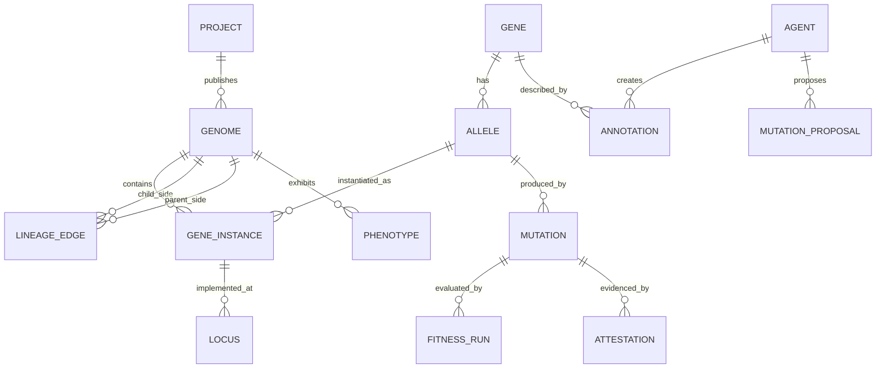
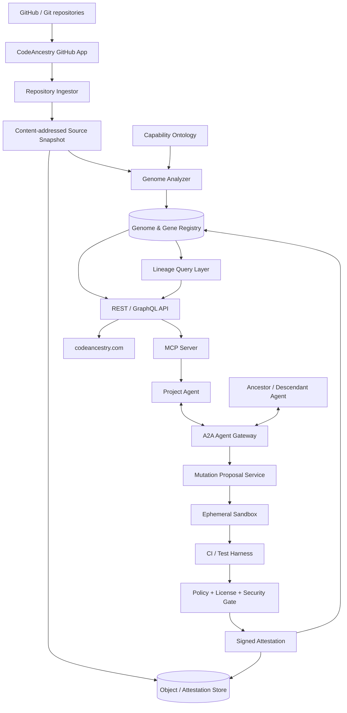
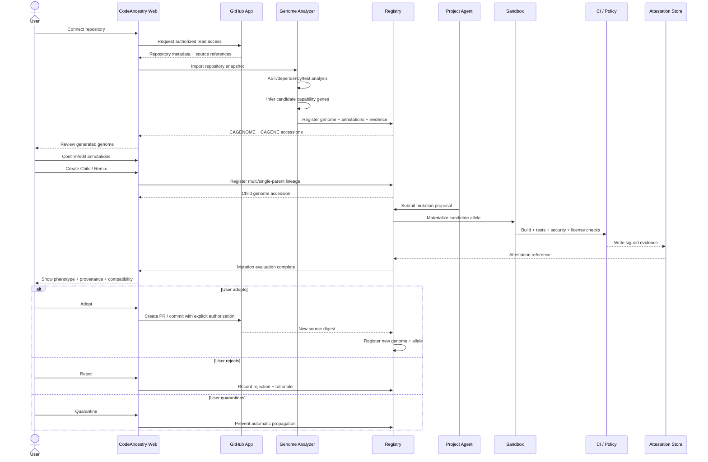
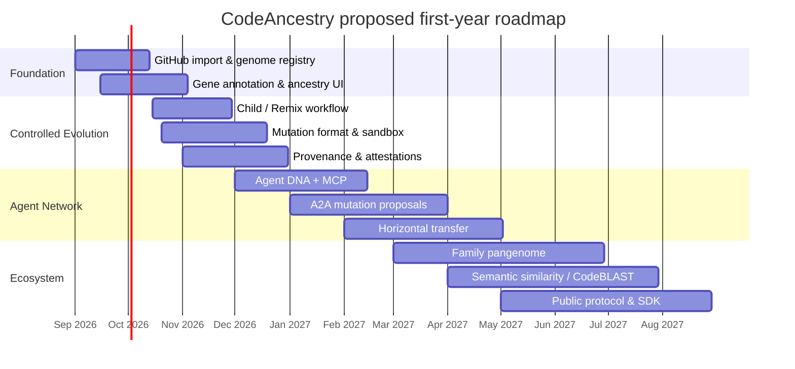
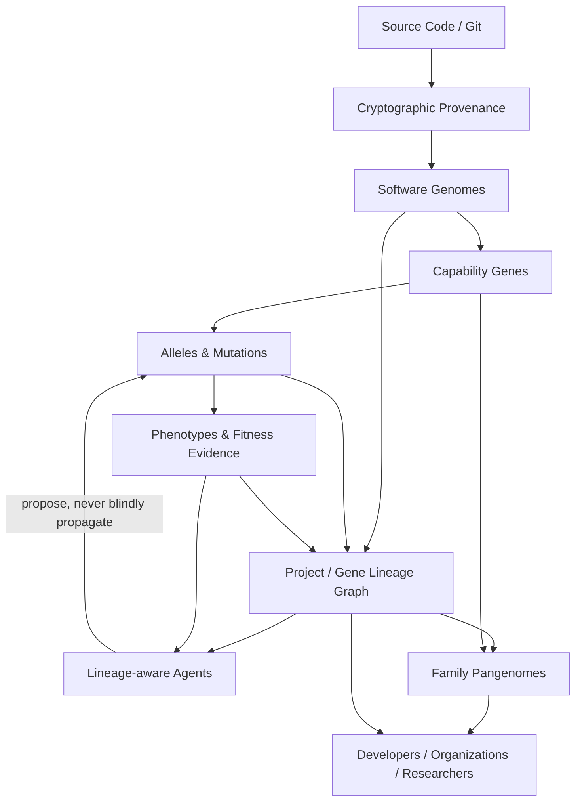

# CodeAncestry: Applying Genetics, Genomics, and Bioinformatics Design Patterns to Living Software Lineages

## Executive summary

CodeAncestry should not be built as a decorative “GitHub family tree.” Its strongest form is a **semantic lineage and provenance system for software**: a platform in which projects possess versioned genomes, reusable capabilities behave like genes, alternative implementations behave like alleles, code changes become mutations, forks and remixes form descent relationships, multiple-parent projects represent recombination, runtime behavior becomes phenotype, tests and operational metrics become fitness evidence, and AI agents become lineage-aware custodians that can discover and propose useful adaptations to relatives.

The biological analogy is surprisingly productive because modern genomics has already solved many analogous information problems: separating a reference from its variants; assigning stable identifiers to entities whose annotations evolve; attaching evidence to assertions; viewing many heterogeneous data tracks over the same coordinate system; reconstructing relationships among descendants; comparing related genomes; searching for similarity instead of exact identity; and maintaining interoperable archives through common formats and controlled vocabularies. NCBI, Ensembl, UCSC, EMBL-EBI, the Gene Ontology ecosystem, the HTS format specifications, PDB, IGV, Nextstrain, and Phylo.io are therefore not merely visual inspirations—they are architectural precedents. citeturn17view0turn17view2turn15view4turn16view6turn17view5

The most important caution is equally significant: **do not copy biology literally**. Software does not have a single natural chromosome coordinate; capabilities may span many files; one file may participate in multiple capabilities; “fitness” is multi-objective and environment-dependent; and software can intentionally transfer functionality between unrelated families far more easily than organisms exchange genes. The canonical CodeAncestry structure should therefore be a **temporal directed graph, not a tree**. Trees remain an excellent visualization for simple descent, but merges, hybrids, cherry-picks, package adoption, and horizontal capability transfer require additional edge types.

A particularly important competitive/design finding is that **CycloneDX already uses biological ancestry terminology**. Its Pedigree model records component ancestors, descendants, variants, commits, diffs, patches, enhancements, and fixes. Therefore, “we track ancestors of software” by itself is not a defensible technical contribution. CodeAncestry should build above this level by adding **semantic capability genes, alleles, genotype/phenotype separation, evidence-backed annotations, comparative family genomics, agent lineage, experimentally evaluated mutations, and controlled inheritance between living descendants**. citeturn15view0

For provenance, CodeAncestry should not invent a parallel security universe. W3C PROV already models provenance through entities, activities, and agents; in-toto statements bind claims to immutable artifact digests and typed predicates; SLSA defines progressively stronger supply-chain guarantees; and GitHub now exposes signed artifact attestations containing repository, commit, workflow, environment, and related provenance. These standards should become the substrate underneath the genetic metaphor. citeturn15view1turn15view3turn15view2turn20view4

The proposed core is therefore:

```text
Git repository                 = physical source material
Genome                         = versioned project composition
Gene                           = stable semantic capability
Allele                         = one implementation of that capability
Locus                          = source locations implementing the capability
Mutation                       = change producing a new allele/genome state
Genotype                       = capability/allele/configuration composition
Phenotype                      = measured behavior in an environment
Annotation                     = evidence-backed claim about the genome
Fitness                        = vector of measured outcomes, not one magic score
Phylogeny                      = project/capability descent
Recombination                  = multi-parent remix/merge
Horizontal gene transfer       = capability transfer across unrelated families
Pangenome                      = union of capabilities/alleles across a project family
Agent DNA                      = agent identity + policies + tools + knowledge references
```

The closest visualization precedent is the genomic browser: instead of displaying billions of bases as raw text, UCSC places heterogeneous annotation tracks under a common coordinate range, supports search, zooming, filtering, custom tracks, and drill-down pages. CodeAncestry should make the same conceptual move with source code: **users should see capability, provenance, test, license, security, ownership, agent, mutation, and performance tracks rather than staring at a wall of diffs.** citeturn15view4

Nextstrain offers the complementary macro-scale pattern: build a lineage, infer or attach mutations to branches, add metadata, and export the combined result for interactive exploration. That pattern maps almost directly onto CodeAncestry’s project-family view. citeturn15view6

iturn11image3

My principal architectural recommendation is to start with **PostgreSQL as the authoritative database**, representing lineage edges explicitly and storing extensible annotations in `jsonb`; PostgreSQL supports indexed JSONB and recursive queries, which is sufficient for an MVP-scale lineage DAG. Introduce a dedicated graph database only when measured traversal workloads justify operating a second data system. citeturn20view2turn20view3

Finally, **Agent DNA should not mean copying a proprietary model's hidden weights, hidden chain-of-thought, or private memory.** It should be a portable, auditable manifest describing an agent's identity, permitted tools, policies, public decision memories, ontology version, trusted relatives, capabilities, and signed observations. MCP is appropriate for exposing CodeAncestry registries and tools to agents; A2A is appropriate for exchanging typed tasks and proposals among agents. Both now have official interoperability specifications, but neither automatically creates safe cross-agent inheritance—CodeAncestry must define that policy layer itself. citeturn20view0turn20view1

The recommended first product is consequently narrow:

> **Connect GitHub → Generate Genome → Review Genes → Explore Ancestry → Create Child → Propose Mutation → Test in Sandbox → Attest Results → Adopt or Reject.**

That is enough to prove the entire idea without attempting autonomous evolutionary software on day one.

## Research foundation and source priorities

The CodeAncestry concept arose from a practical problem rather than a biological thought experiment. KEYLIT demonstrated that once an application becomes useful, different users naturally want different descendants: a children's version, an accessibility-focused version, a classroom version, another language, another interface, or something that keeps only a portion of the original capability. Traditional Git can preserve commits and branches, but the human meaning of inheritance—*which capabilities are inherited, why they exist, what the child changed, which adaptations should flow back, and what an agent learned from them*—is mostly implicit.

The idea therefore progressed through several conceptual stages:

```text
Fork
  ↓
Remix / Cover / Child
  ↓
Persistent parent-child relationship
  ↓
Semantic capability inheritance
  ↓
Software genome
  ↓
Agent DNA
  ↓
Agents connected across generations
  ↓
Mutation proposals moving up/down/across lineage
  ↓
Family-wide software pangenome
```

The genomics sources below should be consulted in a deliberate order. The first tier defines patterns that should influence the **actual protocol**. The second tier primarily informs **analysis and interaction design**. The third provides inspiration for later **predictive models**.

| Priority | Source | What it establishes | What CodeAncestry should borrow |
|---|---|---|---|
| **Foundational** | **NCBI / GenBank / NCBI Gene** | NCBI Gene joins nomenclature, reference sequences, maps, pathways, variations, phenotypes, and external resources around a stable record; NCBI data packages explicitly separate sequences, annotation, and metadata. citeturn17view0turn16view4 | Stable accessions; canonical records; separation of source artifacts from annotations; cross-references; downloadable packages. |
| **Foundational** | **Ensembl / EMBL-EBI** | Ensembl Compara builds gene trees, infers homologues and families, performs pairwise/multiple genome alignment, reconstructs ancestral sequence, and records conservation/synteny. citeturn17view2 | Comparative software genomics: find homologous genes across projects, reconstruct capability ancestry, compare families rather than isolated repos. |
| **Foundational** | **UCSC Genome Browser** | UCSC overlays independently generated annotation tracks on a coordinate system with search, zoom, filtering, custom tracks, and details pages. citeturn15view4 | A “Code Genome Browser” with capability, mutation, test, license, security, ownership, provenance, and agent tracks. |
| **Foundational** | **Gene Ontology / Sequence Ontology** | GO uses formally related, species-agnostic concepts so annotations remain comparable across organisms; each functional annotation can carry an evidence code indicating how it was supported. citeturn16view6turn16view7 | A CodeAncestry capability ontology plus explicit evidence classes for every machine-generated semantic claim. |
| **Foundational** | **FASTA/GFF/VCF/BED/SAM/BAM standards** | Genomics separates sequence, feature annotation, intervals, variation, and alignments into specialized interoperable formats. Current canonical HTS specifications include SAM/BAM, VCF/BCF, BED, indexing, and content-derived reference retrieval. citeturn16view0turn16view2turn16view3 | Small composable interchange formats rather than one enormous proprietary database export. |
| **Foundational** | **W3C PROV** | PROV formalizes provenance around entities, activities, and agents, with interchange formats and validation semantics. citeturn15view1 | Semantic provenance graph underneath the ancestry metaphor. |
| **Foundational** | **CycloneDX Pedigree** | Pedigree already models ancestors, descendants, variants, commits, patches, enhancements and fixes. citeturn15view0 | Interoperate instead of duplicating SBOM/pedigree data; clearly differentiate CodeAncestry at the semantic/evolutionary layer. |
| **Foundational** | **SLSA + in-toto** | SLSA specifies security levels and provenance requirements; in-toto statements bind typed predicates to content-digested subjects. citeturn15view2turn15view3 | Signed mutation/test/build evidence; immutable mutation identity; policy verification before inheritance. |
| **Strong design precedent** | **PDB / wwPDB** | wwPDB operates a common archive with deposition, validation, biocuration and community data standards while multiple member sites can present different views of the same canonical archive. citeturn17view5turn17view6 | A canonical CodeAncestry registry plus multiple independent clients; validation at deposit time; immutable accessions. |
| **Strong design precedent** | **BLAST** | BLAST searches biological sequence databases for local similarity rather than requiring exact identity. citeturn4search0 | “BLAST for capabilities”: locate related implementations across unrelated repositories using structure/API/tests/semantic signatures. |
| **Strong design precedent** | **IGV / igv.js** | IGV integrates multiple genomic data and metadata sources into a high-performance interactive viewer; its JavaScript version is embeddable. citeturn15view5 | Progressive rendering and track interaction patterns for large software genomes. |
| **Strong design precedent** | **Nextstrain** | Nextstrain workflows combine sequence preparation, phylogeny construction, ancestral reconstruction, branch mutation annotation, metadata, and interactive visualization. citeturn15view6 | Mutation-on-branch project evolution, temporal filtering, descendant exploration, and automated lineage builds. |
| **Strong design precedent** | **Phylo.io** | Phylo.io is explicitly designed to visualize and compare individual or paired phylogenetic trees, including large trees. citeturn15view7 | Side-by-side parent/child and branch/branch comparisons with correspondence highlighting. |
| **Advanced inspiration** | **Google DeepMind AlphaGenome** | AlphaGenome evaluates the predicted impact of a changed DNA sequence by comparing mutated and unmutated inputs and predicts many regulatory properties. citeturn17view3 | Long-term “mutation effect predictor” that estimates which capabilities/metrics a code mutation may influence before expensive testing. |
| **Advanced inspiration** | **Google DeepMind Enformer** | Enformer illustrates that function can depend on long-range context rather than only the immediately adjacent sequence. citeturn17view4 | Capability extraction should consider distant dependencies, configuration, tests, API consumers and runtime effects—not only the changed file. |

This source hierarchy suggests a deeper product principle: **CodeAncestry should separate factual evidence from interpretation.** UCSC explicitly collates tracks rather than forcing a conclusion, while GO annotations state both a claim and the type of evidence supporting it. CodeAncestry should likewise distinguish “Git proves commit X descended from Y” from “an AI believes this code implements MIDI scheduling.” The former is structural provenance; the latter is a semantic annotation with a confidence score and evidence trail. citeturn15view4turn16view7

The PDB precedent is particularly valuable. wwPDB keeps a single canonical archive while several international sites expose their own tools and interfaces. That suggests that CodeAncestry can eventually support ChatGPT/Codex, Claude, Grok, Cursor, GitHub and independent applications **without making any of them the owner of the ancestry graph**. The registry can remain neutral while clients supply different views and agent implementations. citeturn17view6

## Genetic concepts translated into software lineage

The basic biological terms are useful, but their software meanings need strict definitions or the metaphor becomes vague.

| Biological concept | Biological definition / role | CodeAncestry analogue | Implementation notes | Recommended UI |
|---|---|---|---|---|
| **Gene** | A basic unit of inheritance containing information contributing to biological traits/functions. citeturn19view2 | **Stable semantic capability** such as MIDI input, lesson scoring, OAuth login, PDF rendering, search, or a scheduling algorithm. | A gene must not equal “one file.” It may map to several source loci, APIs, dependencies, tests and configuration. Assign stable `CAGENE:` accessions. | Gene card; capability icon; source-locus track; “used by descendants” map. |
| **Genome** | The complete set of DNA instructions of an organism. citeturn19view0 | **Complete versioned composition of a project**: genes, alleles, configuration, dependencies, policies, agent manifest and source snapshot. | Immutable genome snapshot identified by project + source digest; mutable project points to successive genomes. | Genome overview; chromosome-like capability bands; summary statistics. |
| **Allele** | One of multiple versions of a DNA sequence at a particular genomic location. citeturn18view0 | **Alternative implementation of the same capability.** | `MIDI-SCHEDULER` might have `browser-v1`, `worker-v2`, `low-latency-v3`; identity remains one gene while implementation changes. | Allele selector and comparison panel. |
| **Locus** | A physical site/location within a genome. citeturn19view0 | **Source location implementing or regulating a gene.** | Address by repo/path/symbol/range plus commit digest. Line numbers alone are unstable. | Source track highlights; jump-to-code. |
| **Mutation / variant** | A mutation is a DNA sequence change; variants can have no effect or alter function. citeturn18view1turn19view0 | **A code/configuration/model/prompt change that creates a new genome or allele state.** | Separate mutation identity from effect. A 1-line change may be high-impact; a large refactor may be phenotype-neutral. | Branch mutation badge; diff; predicted/observed impact. |
| **Recombination** | Exchange of genetic material generates new combinations of alleles. citeturn18view2turn18view6 | **A multi-parent child assembled from capabilities/alleles of multiple projects.** | Represent as multiple parent edges plus explicit contribution records—not a fake single parent. | Sankey showing parent contributions; hybrid badge. |
| **Phylogeny** | Branches represent transmission across generations; branch length can represent amount of genetic change. citeturn18view3 | **Version/project/capability lineage.** | Git gives many descent relationships directly, so inference is needed only when source metadata is incomplete. Branch length can mean elapsed time, commits, semantic distance or tested behavioral distance—user selects metric. | Time-scaled tree with mutations on branches. |
| **Fitness** | Evolutionary fitness is context-dependent; adaptive landscapes can contain local rather than global optima. citeturn18view5 | **A vector of measurable quality outcomes under a defined environment.** | Never collapse automatically into one universal number. Store latency, correctness, CPU, cost, accessibility, UX, security, adoption, etc. separately. | Radar/parallel-coordinate profile; before/after metric cards. |
| **Selection** | Differential persistence/reproduction makes some variants more prevalent; selection can act on variation and recombination. citeturn18view6turn19view0 | **Policy-governed adoption or rejection of mutations.** | Tests, maintainers, organizational rules and user choice—not an unsupervised agent—determine adoption. | “Candidate → Tested → Accepted/Rejected/Quarantined” lifecycle. |
| **Horizontal gene transfer** | Transfer of genetic material across species rather than solely parent-to-offspring descent. citeturn18view4 | **Capability transfer between otherwise unrelated project families.** | Package adoption, cherry-pick, copied algorithm, extracted library, agent-assisted transplant. Preserve original provenance and license. | Chord/arc between separate lineage trees. |
| **Genotype** | A characterization of variant state at genomic locations. citeturn19view1 | **The exact gene/allele/configuration set that a project carries.** | Machine-readable and reproducible. “What the project contains.” | Genome manifest and allele table. |
| **Phenotype** | Observable traits emerge from genotype plus environmental factors. citeturn18view0 | **Observed behavior of a specific genome in a specific environment.** | Runtime, hardware, browser, OS, model provider, data and load are part of the environment record. | Environment selector + measured behavior dashboard. |
| **Gene expression** | Information encoded in genes is turned into function, with expression varying by context. citeturn19view2 | **Which inherited capabilities are actually activated/configured in a deployment.** | A project may carry a feature but disable it via feature flags, edition, runtime or environment. | Active/inactive gene overlay. |
| **Annotation** | Genomic resources attach functional assertions to genes/features; GO annotations carry evidence for the assertion. citeturn16view7 | **Claim about a capability, source locus, ownership, security relevance, phenotype or relationship.** | Every annotation needs author/agent, timestamp, method, evidence code, confidence and source genome. | Toggleable annotation tracks; evidence tooltip. |
| **Ontology** | GO provides standardized terms and formal relations so functions can be compared across organisms. citeturn16view6 | **Controlled vocabulary of software capabilities and relationships.** | Start small and extensible. Use hierarchical terms with multiple parents rather than a rigid taxonomy. | Ontology explorer; facet filters; relationship graph. |
| **Pangenome** | A pangenome captures genome variation across many members of a population and provides a broader reference. citeturn19view0 | **Union of all genes and significant alleles found throughout a project family.** | This becomes more informative than treating original `main` as the only reference after thousands of descendants evolve. | Family pangenome matrix: projects × genes/alleles. |

Several refinements follow from this mapping.

**A software “gene” should be semantic, not syntactic.** A function, class, package and gene are not synonymous. A capability such as “MIDI input normalization” might involve browser event handling, a device registry, timing code, tests and UI state. Conversely, a utility file may serve ten genes. This resembles the broader genomics lesson that functional interpretation is layered on top of underlying sequence rather than being identical to a single storage unit. NCBI itself presents gene records as integrations of sequences, nomenclature, maps, variation, phenotype and external references rather than as raw sequence alone. citeturn17view0

**Allele is a better concept than “version.”** Versions are temporal; alleles are alternatives at a semantic locus. Two distant descendants may independently carry functionally equivalent implementations even when their source code and release numbers differ.

**Genotype versus phenotype is one of the most valuable distinctions for CodeAncestry.** The genotype says a browser application carries a low-latency MIDI scheduling allele. The phenotype says that on Safari 19 / macOS / a particular device it produced 11 ms median scheduling delay in a specified benchmark. The same genotype may exhibit a different phenotype under another environment, mirroring the biological principle that observed phenotype reflects both genomic makeup and environment. citeturn18view0

**Fitness must remain explicitly contextual and multidimensional.** There is no scientifically meaningful software equivalent of a universally “stronger gene.” A mutation that lowers latency may consume more memory; one that increases accessibility may add bundle size; an enterprise security policy may reject behavior that is ideal for a hobbyist. Even biological adaptive landscapes can have local rather than universal optima. citeturn18view5

**CodeAncestry should add the pangenome concept early.** Once KEYLIT has hundreds of descendants, the original repository ceases to represent everything the family has learned. The **KEYLIT pangenome** would instead contain the union of inherited and newly evolved capabilities across the entire family. The user could ask:

> Which descendants carry the adaptive-practice gene?

or:

> What is the highest-performing tested allele of MIDI scheduling that is license-compatible with my child?

That is far more powerful than “show forks.”

A conceptual entity model is:



The most important graph edge types should be explicit:

```text
DERIVED_FROM
RECOMBINED_FROM
MUTATED_FROM
TRANSFERRED_FROM
IMPLEMENTS
EXPRESSES
DEPENDS_ON
ANNOTATED_BY
PROPOSED_BY
TESTED_BY
ATTESTED_BY
ADOPTED_FROM
REJECTED_FROM
```

This is also why the “pyramid” visual from the original idea should be treated as only one presentation. The actual data structure is closer to a **temporal property graph with typed provenance edges**.

## Data model, interchange formats, and provenance

Bioinformatics has an important architectural habit: **do not force all information into one file format**. FASTA represents sequence simply; GFF represents features; BED represents intervals; VCF represents variation; SAM/BAM represent alignments; GenBank records combine a richer archival description with sequence and annotations; modern NCBI genome packages distribute sequence, annotation and JSON metadata together but separately. citeturn16view0turn16view2turn16view3turn16view4turn16view5

That separation is exactly what CodeAncestry needs.

| Bioinformatics format/pattern | Purpose | CodeAncestry analogue | Recommendation |
|---|---|---|---|
| **FASTA** | Minimal identifier + primary sequence. NCBI FASTA starts records with a unique sequence ID before the sequence. citeturn16view0 | Immutable source/reference identity | Do **not** invent a source-code alphabet. Use Git object IDs/content hashes plus a compact source manifest. |
| **GFF/GFF3** | Features positioned on a reference sequence | `features.jsonl` / gene-locus records | Annotate source symbols/ranges with semantic genes, tests, APIs and evidence. |
| **BED** | Compact genomic intervals; BED has three required coordinate fields and optional annotation fields. citeturn16view3 | Lightweight code-locus intervals | A simple TSV for path + symbol/range + gene ID is useful for tooling and visualization. |
| **VCF/BCF** | Reference-versus-alternate variants | `mutation.cavcf` | Excellent conceptual model for mutation events; use content digests instead of embedding proprietary source code. |
| **SAM/BAM/CRAM** | Observations/reads aligned to a reference | Runtime/test observations mapped back to source genes/loci | Do not clone BAM in MVP; emit compact JSONL links between traces/tests and affected genes. |
| **GenBank** | Rich archival record with stable accession, metadata, features and sequence | Complete portable genome record | `genome.json` plus related files in a signed package. |
| **NCBI Data Package** | Bundles sequence, GFF/GTF/GBFF and JSONL metadata. citeturn16view4 | Exportable CodeAncestry package | `genome.json`, genes, mutations, phenotype, evidence, attestations and README bundled together. |
| **Refget/content-derived IDs** | HTS specifications include reference retrieval using an identifier derived from sequence content. citeturn16view2 | Content-addressed code identity | Use SHA-256/Git object identity so lineage records remain verifiable after names/URLs change. |

A key lesson from GenBank is that **stable accessions are more important than human-facing labels**. NCBI's own sample record documentation recommends searching by accession because accessions are stable while locus names can change. citeturn16view5

CodeAncestry should therefore assign identifiers such as:

```text
CAPROJ:01J...
CAGENOME:01J...
CAGENE:01J...
CAALLELE:01J...
CAMUT:01J...
CAAGENT:01J...
CAEV:01J...
```

Human names such as `KEYLIT`, `MIDI Scheduler`, or `Adaptive Lesson Engine` remain editable labels. The accessions do not.

**Proposed `genome.json`.**

```json
{
  "$schema": "https://schema.codeancestry.com/genome/v0.1.json",
  "genome_id": "CAGENOME:01JKEYLIT7H2",
  "project_id": "CAPROJ:01JKEYLIT000",
  "name": "KEYLIT",
  "generation": 0,

  "source": {
    "provider": "github",
    "repository": "owner/keylit",
    "commit": "7f08d7...",
    "tree_digest": "sha256:5a9b..."
  },

  "parents": [],

  "genes": [
    {
      "gene_id": "CAGENE:MIDI-INPUT",
      "allele_id": "CAALLELE:MIDI-INPUT:1",
      "expression": "active"
    },
    {
      "gene_id": "CAGENE:LESSON-ENGINE",
      "allele_id": "CAALLELE:LESSON-ENGINE:3",
      "expression": "active"
    }
  ],

  "agent_dna": {
    "agent_id": "CAAGENT:KEYLIT:0",
    "manifest": "agent-dna.json"
  },

  "phenotypes": [
    "phenotypes/browser-midi.jsonl"
  ],

  "provenance": {
    "prov_bundle": "provenance/prov.jsonld",
    "attestations": [
      "attestations/genome.intoto.jsonl"
    ]
  },

  "licenses": {
    "spdx_expression": "MIT"
  }
}
```

Notice what is deliberately absent: the record does not need to duplicate the entire repository. The repository remains the source of truth; the genome describes its semantic and lineage state.

**Proposed `gene.yaml`.**

```yaml
schema: https://schema.codeancestry.com/gene/v0.1.json
gene_id: CAGENE:MIDI-SCHEDULING
name: MIDI Scheduling
ontology:
  capability: input.music.midi.scheduling
  component:
    - browser.audio
    - browser.midi
  process:
    - lesson.playback

description: >
  Normalizes incoming MIDI timestamps and schedules
  note events relative to the application's audio clock.

loci:
  - repository: owner/keylit
    commit: 7f08d7...
    path: src/midi/scheduler.ts
    symbol: MidiScheduler
  - repository: owner/keylit
    commit: 7f08d7...
    path: src/audio/clock.ts
    symbol: AudioClock

contracts:
  inputs:
    - MidiMessage
  outputs:
    - ScheduledNoteEvent

tests:
  - tests/midi/scheduling.spec.ts

dependencies:
  - CAGENE:AUDIO-CLOCK

annotations:
  - term: capability.latency_sensitive
    evidence:
      code: TST
      source: tests/midi/scheduling.spec.ts
      confidence: 1.0

current_alleles:
  - CAALLELE:MIDI-SCHEDULING:3
```

A CodeAncestry ontology should borrow GO's fundamental rule that terms and annotations are separate. GO defines a structured graph of concepts, and an annotation then asserts that a particular gene product relates to a term; evidence codes indicate how that assertion was established. citeturn16view6turn16view7

A first **CodeAncestry Evidence Vocabulary** could be:

| Code | Meaning |
|---|---|
| `HVR` | Human verified |
| `TST` | Demonstrated by automated test |
| `RUN` | Demonstrated by runtime observation |
| `STA` | Static-analysis inference |
| `DEP` | Declared by dependency/package metadata |
| `UPR` | Declared by upstream maintainer |
| `AII` | AI-inferred, not independently verified |
| `PHY` | Inferred from lineage/homology |
| `SEC` | Security-scanner evidence |

The distinction is crucial. An LLM may confidently infer that five files comprise a “lesson engine,” but that statement should begin life as `AII`, not as established truth.

**Proposed VCF-like mutation format.**

VCF's basic conceptual power comes from describing a variation relative to a reference rather than replacing the entire reference. Current HTS specifications designate VCF 4.5 as the canonical VCF specification. citeturn16view2 CodeAncestry can adopt the pattern without pretending source code is DNA:

```text
##fileformat=CodeAncestryMutationVCFv0.1
##reference=CAGENOME:01JKEYLIT7H2
#PROJECT    LOCUS                     ID          REF              ALT              QUAL  FILTER  INFO
CAPROJ:K    CAGENE:MIDI-SCHEDULING    CAMUT:882   sha256:8c20...   sha256:b551...   0.97  PASS    TYPE=OPTIMIZATION;AGENT=CAAGENT:KIDS:4;COMMIT=9ad1...;TEST=CAEV:991;LATENCY_DELTA=-0.18
```

Here `REF` and `ALT` are immutable content/allele digests rather than source-code bodies. This lets a public registry reveal lineage without leaking a private implementation.

A complementary phenotype file might be:

```json
{
  "phenotype_id": "CAPHENO:882",
  "genome_id": "CAGENOME:KEYLIT-KIDS:14",
  "environment": {
    "browser": "Safari",
    "os": "macOS",
    "device_profile": "midi-lab-a"
  },
  "metrics": {
    "midi_latency_ms_p50": 9.7,
    "midi_latency_ms_p95": 14.1,
    "test_pass_rate": 1.0
  },
  "evidence": "CAEV:991",
  "run_digest": "sha256:..."
}
```

This leads to a useful formula:

\[
\text{Phenotype} =
f(\text{Genome},\ \text{Environment},\ \text{Inputs},\ \text{Runtime})
\]

and:

\[
\text{Fitness} =
\left[
f_{\text{correctness}},
f_{\text{latency}},
f_{\text{cost}},
f_{\text{security}},
f_{\text{accessibility}},
f_{\text{UX}},
\ldots
\right]
\]

not:

\[
\text{Fitness} = 87/100
\]

unless an individual organization explicitly defines a weighted policy function.

**Provenance should sit below every one of these abstractions.** W3C PROV's entity/activity/agent model maps cleanly:

```text
Entity    → genome, allele, source artifact, mutation, test result
Activity  → commit, remix, build, test, adoption, migration
Agent     → person, organization, CI runner, AI agent
```

W3C PROV was explicitly created to make provenance interoperable and useful in assessing quality, reliability and trustworthiness. citeturn15view1

in-toto adds a highly practical cryptographic pattern. Its statement structure associates an immutable subject digest with a typed predicate. CodeAncestry mutation evidence can therefore be serialized as an in-toto predicate instead of inventing a proprietary signing envelope. citeturn15view3

```json
{
  "_type": "https://in-toto.io/Statement/v1",
  "subject": [
    {
      "name": "CAALLELE:MIDI-SCHEDULING:4",
      "digest": {
        "sha256": "b551..."
      }
    }
  ],
  "predicateType":
    "https://codeancestry.com/attestation/mutation-test/v0.1",
  "predicate": {
    "mutation": "CAMUT:882",
    "test_run": "CAEV:991",
    "result": "PASS"
  }
}
```

SLSA should govern how strongly CodeAncestry trusts production/build provenance; the approved SLSA 1.2 specification separates source and build tracks and defines increasing levels of assurance. citeturn15view2 GitHub Artifact Attestations can already produce signed claims containing commit SHA, repository, workflow and environment information, making them a natural input when a repository uses GitHub Actions. GitHub explicitly cautions that an attestation proves provenance, not that the artifact itself is safe; CodeAncestry should preserve that distinction. citeturn20view4

This produces the appropriate trust ladder:

```text
AI says mutation is good
        │
        ▼
Unverified proposal
        │
        ▼
Source provenance verified
        │
        ▼
Build provenance verified
        │
        ▼
Sandbox tests passed
        │
        ▼
Security / license policies passed
        │
        ▼
Maintainer approved
        │
        ▼
Adopted allele
```

The agent never gets to skip the ladder.

## Visualization and product UX

The genomics websites reveal two complementary visualization problems.

At the **micro scale**, the user asks, “What exists around this location/capability?” UCSC and IGV solve this through coordinate browsing, tracks, zoom, filtering and contextual details. UCSC specifically stacks annotation tracks below genome coordinates so users can correlate heterogeneous information while zooming from broad regions to individual features; IGV likewise integrates diverse genomic data and metadata into an interactive viewer. citeturn15view4turn15view5

At the **macro scale**, the user asks, “How are these organisms/variants related?” Nextstrain and Phylo.io solve this with trees, branch metadata, mutation display and comparative phylogenies. Nextstrain's workflow can infer ancestral states, identify mutations on branches and export node annotations into the Auspice visualization layer; Phylo.io specializes in viewing and comparing two tree structures. citeturn15view6turn15view7

CodeAncestry should implement both scales.

| Visualization | Biological use | CodeAncestry use | Priority |
|---|---|---|---|
| **Linear genome browser** | Genes/variants/annotations across genomic coordinates | Files/symbols/capabilities along a selected software locus | **MVP** |
| **Annotation tracks** | Genes, expression, variants, conservation, reads | Genes, tests, agent edits, license, security, ownership, coverage, metrics | **MVP** |
| **Phylogenetic tree** | Descent and divergence | Project generations and branch mutations | **MVP** |
| **Comparative tree** | Compare alternative phylogenies | Compare two child branches or inferred vs declared ancestry | **3-month** |
| **Mutation heatmap** | Variants across samples/populations | Genes × descendants showing which allele/mutation each carries | **3-month** |
| **Sankey** | Flow/contribution | Multi-parent remix contribution to child genome | **3-month** |
| **Chord diagram** | Relationships between regions/groups | Horizontal gene transfer among unrelated project families | **6-month** |
| **Circular genome** | Compact whole-genome overview | Decorative/high-level capability composition | **Secondary** |
| **Timeline** | Samples and lineage over time | Commits, births, mutations, adoptions, rollbacks | **MVP** |
| **Fitness landscape** | Evolutionary adaptation | Compare allele performance under selected environments | **6-month** |

The linear view requires one adaptation: code has no universal chromosome coordinate. I recommend three interchangeable coordinate systems.

**Repository coordinates** follow directory/file/symbol/range. They are ideal for developers.

**Semantic coordinates** group source locations by capability gene. They are ideal for product owners and agents.

**Temporal coordinates** organize changes by commits/releases. They are ideal for provenance.

An initial project genome browser could look like:

```text
┌────────────────────────────────────────────────────────────────────────────┐
│ KEYLIT / CAGENOME:...       Search gene, file, commit, agent...           │
├────────────────────────────────────────────────────────────────────────────┤
│ ← Parent: KEYLIT v1        Generation 4         Children: 12       Compare │
├────────────────────────────────────────────────────────────────────────────┤
│ src/midi/         scheduler.ts              audio.ts               lessons │
│ ────────────────────────────────────────────────────────────────────────── │
│ GENES       [ MIDI Input ====== ][ MIDI Scheduler ==== ][ Lesson Engine ] │
│ MUTATIONS                ▲ M-882        ▲ M-901                         │
│ TESTS        ████████████████████████████████████████████████            │
│ AGENTS                 A4      A4             Human                       │
│ LICENSE      MIT──────────────────────────────────────────────────────     │
│ SECURITY                    ! dependency advisory                         │
│ FITNESS                 -18% latency       +3% CPU                         │
├────────────────────────────────────────────────────────────────────────────┤
│ Selected: MIDI Scheduler / allele 4                                      │
│ Origin: KEYLIT Gen 0 → Kids Gen 2 → Kids ES Gen 4                        │
│ Evidence: 3 tests • 1 runtime • signed provenance                         │
└────────────────────────────────────────────────────────────────────────────┘
```

The central family screen should be different:

```text
                       KEYLIT
                    Gen 0 • 2026
                        │
             ┌──────────┼───────────┐
             │          │           │
          Kids        Studio    Accessible
          Gen 1       Gen 1        Gen 1
             │          │            │
       ┌─────┴────┐     │            │
       │          │     │            │
   Kids ES    Kids NO  Producer    Voice
       │                         ─────╯
       │                         HGT: voice-tutor
       ▼
 Kids Classroom
```

Selecting a branch should expose the exact mutation set, evidence and descendants rather than merely a Git commit count.

For the implementation stack, I recommend:

| Component | Library / approach | Reason |
|---|---|---|
| Family/lineage graph | **Cytoscape.js** | Purpose-built interactive graph rendering and analysis; suitable for typed DAG edges. |
| Remix/workflow editor | **React Flow** | Effective for editable node/edge workflows and agent networks. |
| Custom trees/heatmaps/chords/Sankey | **D3** | Low-level control for specialized genomics-inspired visualizations. |
| Source annotation tracks | **Custom canvas/WebGL layer**, influenced by IGV/igv.js | Track virtualization is more important than reproducing biological coordinates. IGV offers an embeddable JS implementation and demonstrates large-data interaction patterns. citeturn15view5 |
| Architecture documentation | **Mermaid** | Keep protocol diagrams directly beside specifications and source. |
| Very large graphs later | Server-side aggregation + level-of-detail rendering | Do not deliver every descendant edge to the browser at once. |

A crucial UX principle from UCSC is **progressive information density**. Tracks can be hidden, collapsed or filtered to avoid overload. CodeAncestry will need this even more because a mature project could have millions of source loci and many thousands of descendants. citeturn15view4

The primary website navigation should therefore become:

```text
Search
Genome
Family
Genes
Mutations
Phenotype
Agents
Provenance
Security
```

**Search** should work like a cross between NCBI search and BLAST. Exact search resolves known identifiers:

```text
CAGENE:MIDI-SCHEDULING
CAMUT:882
commit:9ad1...
KEYLIT Kids
```

Similarity search should answer:

```text
Find capabilities similar to this implementation.
Find descendants with an equivalent scheduling gene.
Find the closest known allele compatible with my API contract.
```

BLAST's key conceptual lesson is that valuable similarity can exist without exact sequence identity. CodeAncestry's “CodeBLAST” should eventually fingerprint capabilities from AST structure, imports, public contracts, tests, dependency relationships and semantic representations rather than relying only on string similarity. citeturn4search0

**Comparative view** should borrow heavily from Ensembl Compara and Phylo.io. Ensembl compares genes across species to infer homologues, gene families and trees; Phylo.io offers side-by-side tree comparison. citeturn17view2turn15view7 A CodeAncestry comparison might say:

```text
KEYLIT Kids                  KEYLIT Accessible
────────────────────────────────────────────────
MIDI Input       same        MIDI Input
Lesson v4        diverged    Lesson v3
Gamification     unique      —
—                            Voice Navigation
Audio v2         same        Audio v2
UI Kids          diverged    UI Accessible
```

**Mutation review** should expose provenance and phenotype, not just a diff:

```text
MUTATION CAMUT:882
────────────────────────────────────────────────

Proposed by:
  Agent CAAGENT:Kids:7

Inherited gene:
  CAGENE:MIDI-SCHEDULING

Origin:
  KEYLIT Kids Norway / Gen 18

Change:
  scheduler allele 4 → allele 5

Evidence:
  ✓ source digest verified
  ✓ build attested
  ✓ 148 tests passed
  ✓ security policy passed
  ✓ license compatible

Observed phenotype:
  MIDI p50 latency        11.4 ms → 8.9 ms
  CPU                     4.1%    → 4.4%
  Test failures           0       → 0

Compatibility:
  1,284 relatives eligible
  93 require manual review

[ Adopt ]   [ Reject ]   [ Quarantine ]   [ Run More Tests ]
```

That screen is effectively CodeAncestry's equivalent of a clinical variant interpretation page: **a mutation plus evidence plus context**, not “AI thinks this is better.”

## System architecture and evolutionary workflows

The recommended architecture separates **immutable evidence** from **mutable interpretation**.



**Authoritative data layer.** PostgreSQL should be the first authoritative database. `jsonb` supports indexed semi-structured records, while recursive queries allow ancestor/descendant traversal. This avoids premature operational complexity while preserving a path to a graph engine later. citeturn20view2turn20view3

The core relational tables would be approximately:

```text
projects
genomes
genes
alleles
gene_instances
loci
mutations
lineage_edges
annotations
evidence
agents
agent_manifests
mutation_proposals
fitness_runs
phenotypes
attestations
licenses
ontology_terms
ontology_edges
```

`lineage_edges` should use:

```text
source_genome_id
target_genome_id
relationship_type
evidence_id
created_at
confidence
```

This makes `DERIVED_FROM`, `RECOMBINED_FROM`, and `TRANSFERRED_FROM` first-class facts.

A dedicated graph database should become optional when queries such as “find all descendants carrying any allele descended from gene X that also inherited gene Y through a separate lineage” become both common and expensive. Until benchmarks establish that need, a second persistent database is unnecessary.

**Git integration.** A GitHub App is preferable to handing CodeAncestry broad user tokens. GitHub Apps start without permissions and GitHub explicitly recommends selecting the minimum permissions required; app permissions also determine the APIs and webhooks available. citeturn17view7

The first installation should be read-only:

```text
Repository metadata     read
Contents                read
Pull requests           read
Actions/workflows       read where needed
Checks                  read
Metadata                read

Write access            NONE
```

Only after the user deliberately enables “Create Child” or “Apply Mutation” should a separately approved write capability become available.

**Genome analyzer.** Gene extraction should be hybrid:

```text
Repository metadata
        +
language ASTs
        +
dependency graph
        +
tests
        +
API/schema definitions
        +
runtime traces where available
        +
human annotations
        +
LLM semantic inference
        ↓
Candidate capability genes
        ↓
Evidence-coded annotations
        ↓
Human review / auto-approval policy
```

This avoids making an LLM the source of truth. A static analyzer can establish that symbol A calls B; Git can establish that commit X descends from Y; tests can establish behavior under a harness; the model can suggest that the cluster likely represents “MIDI scheduling.” These are different evidence classes.

**Agent DNA.** The manifest should describe a project's lineage-aware agent without pretending to contain the underlying AI model:

```json
{
  "agent_id": "CAAGENT:KEYLIT:7",
  "genome_id": "CAGENOME:KEYLIT:31",

  "runtime": {
    "provider": "external",
    "model_identity_policy": "record-when-disclosed"
  },

  "skills": [
    "analyze_genome",
    "propose_mutation",
    "compare_relative",
    "request_test"
  ],

  "tools": [
    "mcp://codeancestry/registry",
    "mcp://codeancestry/sandbox"
  ],

  "inheritance_policy": {
    "accept_direct_code": false,
    "accept_proposals": true,
    "trusted_relations": [
      "PARENT",
      "CHILD",
      "SIBLING"
    ],
    "require_attestation": true
  },

  "memory": {
    "store_chain_of_thought": false,
    "public_decision_records": [
      "CAMEM:191",
      "CAMEM:207"
    ]
  },

  "identity_key": "did:key:..."
}
```

MCP is designed to standardize integration between LLM applications and external tools/data, while A2A 1.0 is designed for communication and collaboration among agents from heterogeneous systems. The A2A documentation explicitly presents MCP and A2A as complementary: tools/resources on one side, agent-to-agent interoperability on the other. citeturn20view0turn20view1

Therefore:

```text
Agent ↔ CodeAncestry registry/sandbox      MCP
Agent ↔ Relative Agent                     A2A
Mutation/evidence semantics                CodeAncestry protocol
Cryptographic claims                       in-toto / SLSA
```

That division is much cleaner than inventing one giant proprietary agent protocol.

**Agents should exchange claims, not unrestricted memory.**

```text
BAD:
Ancestor Agent
    ↓
"Here is all my memory and code.
Trust me and patch yourself."

GOOD:
Ancestor Agent
    ↓
Mutation Proposal CAMUT:882
    ↓
gene = MIDI scheduling
reason = latency improvement
source = signed genome
evidence = benchmark attestation
compatibility = declared interface v3
    ↓
Descendant evaluates locally
```

A child retains sovereignty.

The central workflow is:



This workflow deliberately borrows from Nextstrain's prepare → construct lineage → annotate → export → visualize pipeline, but adds the security and attestation controls required for executable software. citeturn15view6turn15view2

**Sandboxing is non-negotiable.** A mutation inherited from a relative is still untrusted code. Testing should occur in ephemeral isolation with restricted network access, no reusable credentials, scoped package access, CPU/memory/time limits and explicit artifact outputs. The result—not arbitrary sandbox memory—should be what crosses the boundary. SLSA's emphasis on traceability and secure production of artifacts, together with in-toto's signed step/artifact model, makes these standards appropriate foundations. citeturn15view2turn15view3

GitHub's existing artifact attestation capability can supply provenance for GitHub-hosted builds; its documentation notes that attestations become useful when verified and that they are not themselves guarantees of artifact security. CodeAncestry's policy engine must therefore validate attestations *and* independently decide whether the evidence satisfies local adoption policy. citeturn20view4turn20view5

**Suggested production stack**

| Layer | Recommendation |
|---|---|
| Web | Next.js / React / TypeScript |
| Public edge | Cloudflare DNS/CDN/Workers where useful |
| API | TypeScript initially; Rust/Go only for measured performance hotspots |
| Primary DB | PostgreSQL |
| Flexible annotation storage | PostgreSQL `jsonb` |
| Search | PostgreSQL full text initially; dedicated search service at scale |
| Similarity search | Embedding/vector index as optional secondary index |
| Graph | PostgreSQL lineage edges first; dedicated graph store later if justified |
| Object storage | S3-compatible object store for snapshots, reports and attestations |
| Queue/events | Managed queue initially; Kafka/NATS class infrastructure later |
| Auth | GitHub App + application sessions; enterprise OIDC later |
| CI | GitHub Actions first; generic CI adapters later |
| Supply-chain evidence | SLSA provenance + in-toto statements + GitHub attestations |
| SBOM/licenses | CycloneDX and SPDX ingestion/export |
| Agent tools | MCP server |
| Agent-to-agent | A2A gateway |
| Sandbox | Ephemeral container/microVM workers with policy-controlled networking |
| Visualization | Cytoscape.js + D3 + custom track renderer |
| Observability | OpenTelemetry-compatible tracing/metrics |
| Schema API | JSON Schema + versioned protocol namespaces |

This architecture also creates an attractive long-term platform boundary:

```text
                    CODEANCESTRY

             Genome / Gene / Lineage API
                       │
        ┌──────────────┼──────────────┐
        │              │              │
      GitHub         Agents        CI systems
        │              │              │
        │        ┌─────┼─────┐        │
        │      Codex Claude Grok ...  │
        │              │              │
        └──────────────┼──────────────┘
                       │
                  Evidence graph
```

CodeAncestry does **not** need unrestricted internal data from GitHub, Codex, Claude, Grok or Cursor. It needs a common, user-authorized format in which those systems can publish facts or proposals about a project.

That is a substantially more realistic route to “all the genes are connected.”

## Ethics, legal exposure, security, and governance

The biological analogy creates both technical benefits and ethical traps.

The first rule should be:

> **Use genetics as an information-system model, not as a metaphor for human worth.**

Terms such as “fitness,” “selection,” “bloodline,” “purity,” “dominant,” and “superior genes” carry historical and social implications well beyond software. NHGRI itself describes eugenics as a discredited ideology associated with scientific racism, colonialism and ableism. CodeAncestry should use “lineage,” “variant,” “capability,” “fitness under environment X,” and “adoption policy,” while avoiding gamification around genetic “purity.” citeturn19view0

**Intellectual property and licensing** are especially important because horizontal gene transfer in software means copying or adapting protected works. A project's ancestry record must never imply that technical compatibility equals legal permission. Every inherited gene should carry license metadata, attribution sources and an inheritance decision.

SPDX is already an international open standard for representing software component information including licensing, provenance and related metadata, so CodeAncestry should ingest SPDX rather than creating a second license syntax. citeturn14search3turn14search7

A mutation transfer policy should therefore behave roughly as:

```text
Technical compatibility
        +
Source provenance
        +
License compatibility
        +
Required attribution
        +
Patent/security policy
        +
Owner authorization
        ↓
Eligible for adoption
```

Unknown license should mean **unknown**, not “probably reusable.”

AI authorship also requires careful treatment. The U.S. Copyright Office's 2025 AI copyrightability report states that copyrightability depends on sufficient human authorship; its summary explains that purely prompting a system does not itself establish copyright in generated expressive material while human selection, arrangement or modification can matter. CodeAncestry should therefore separately record human creators, AI-assisted operations, source material, and subsequent human review rather than automatically declaring an AI agent “copyright owner.” citeturn14search2turn14search9

**Trademark risk deserves attention now that `codeancestry.com` exists.** Registration of a domain does not by itself create trademark rights; the USPTO explicitly distinguishes domain registration from trademark rights and recommends searching for confusingly similar marks as part of clearance. citeturn14search8turn14search11 Ancestry also publishes active trademark-usage guidelines and identifies its own Ancestry marks. This does not determine whether “CodeAncestry” is legally infringing—similarity, goods/services, jurisdiction and likelihood of confusion matter—but it makes professional clearance prudent before substantial branding investment. citeturn14search0

**Privacy is deeper than private-repository encryption.** A lineage record can reveal developer identities, email addresses, commit activity, corporate architecture, unreleased capabilities, security fixes, failed experiments and AI interactions. For European users, GDPR applies to processing personal data and imposes requirements around lawful processing, minimization, access and related rights. CodeAncestry should therefore treat identity and provenance visibility as explicit scopes rather than automatically publishing everything found in Git metadata. citeturn10search0

Recommended visibility should exist independently at each layer:

```text
Project              public / organization / private
Genome metadata      public / organization / private
Gene names           public / organization / private
Source loci          public / organization / private
Mutation content     public / organization / private
Phenotype metrics    public / organization / private
Agent memories       public / lineage-only / private
Developer identity   public / pseudonymous / private
```

A public project might expose:

```text
Mutation CAMUT:882 exists.
Gene: MIDI Scheduling
Latency improvement: 18%
Attestation: valid
Origin family: KEYLIT Kids
License: MIT
```

without exposing the private child repository that first discovered it.

**Agent privacy should be even stricter.** CodeAncestry should not request or store hidden chain-of-thought. A useful inheritance record is a concise explicit artifact:

```text
Observation:
Safari timing drift appears when event timestamps use clock A.

Evidence:
test run CAEV:1290

Decision:
use monotonic audio clock.

Confidence:
0.94

Applicable genes:
MIDI-SCHEDULING
```

That is portable knowledge. Raw private reasoning is not necessary.

**The most serious security threat is evolutionary supply-chain poisoning.** A malicious descendant could intentionally create a mutation that looks beneficial, submit falsified benchmarks and attempt to propagate it through thousands of relatives. CycloneDX's pedigree model and SLSA/in-toto provenance patterns help establish traceability, but provenance alone cannot determine safety. citeturn15view0turn15view2turn20view4

CodeAncestry therefore needs a biological analogue closer to an immune system:

```text
UNTRUSTED MUTATION
       │
       ├── Verify source identity
       ├── Verify lineage claim
       ├── Verify signatures
       ├── Scan dependencies
       ├── Check licenses
       ├── Run isolated tests
       ├── Run security policies
       ├── Compare phenotype
       └── Require local adoption authority
                 │
                 ▼
      Adopt / Reject / Quarantine
```

No agent should obtain a “global mutation push” permission.

Other threat classes and mitigations are:

| Risk | Failure | Mitigation |
|---|---|---|
| **Forged ancestry** | Attacker claims a reputable ancestor | Content hashes, signed provenance, provider verification |
| **Poisoned mutation** | “Optimization” contains backdoor | Sandbox, dependency scan, security policy, maintainer review |
| **Benchmark gaming** | Mutation optimizes narrow test while degrading system | Multi-dimensional phenotype suite; holdout tests; environment diversity |
| **Agent collusion/error cascade** | Relatives mutually reinforce a false conclusion | Independent evidence; no trust based solely on vote count |
| **Prompt injection from repository text** | Malicious README/comment manipulates analyzer agent | Treat repository content as untrusted data; tool/policy isolation |
| **Private-code leakage** | Agent exports implementation to relatives | Proposal-level sharing; hashes/metrics by default; explicit content authorization |
| **License laundering** | Copied code appears as a “new gene” | Preserve source ancestry and SPDX metadata through every transfer |
| **Lineage deletion** | Descendant removes inconvenient provenance | Append-only signed evidence; tombstones rather than historical rewrite |
| **Bad ancestor update** | Upstream compromise affects many children | Local evaluation; staged adoption; lineage-wide quarantine notices |
| **Agent identity spoofing** | Malicious agent impersonates trusted relative | Signed agent identities, scoped credentials, rotation/revocation |

The word **selection** should consequently mean governance:

\[
\text{Selection Policy}
=
\text{Compatibility}
\land
\text{Evidence}
\land
\text{Security}
\land
\text{License}
\land
\text{Local Authorization}
\]

not “the AI network collectively decided this gene should spread.”

That distinction is what keeps CodeAncestry from becoming an uncontrolled self-modifying software network.

The EU AI Act is another reason to maintain explicit provider/deployer roles, audit records, risk classification and human-control boundaries as the platform grows into agentic automation; applicability will depend on the particular system and use case. citeturn10search1

A governance model should eventually distinguish:

```text
Protocol governance        schema/ontology evolution
Registry governance        accessions and public records
Project governance         who controls a family
Gene governance            maintainers of shared capabilities
Agent governance           allowed actions and trust scopes
Security governance        emergency quarantine/revocation
Ontology governance        term additions/deprecations
```

PDB is an instructive precedent here: it combines common archival standards and validation with independent international presentation sites, rather than allowing each interface to redefine the canonical underlying record. citeturn17view5turn17view6

## Implementation roadmap, success metrics, and prioritized references

The roadmap should resist the temptation to build “agents that evolve the entire Internet” first. The initial proof has to demonstrate that semantic inheritance is useful **even before autonomous agents are involved**.

| Horizon | Deliverables | Why it matters |
|---|---|---|
| **MVP / first six weeks** | GitHub App; read-only repository import; immutable genome ID; first `genome.json`; capability-gene extraction; human annotation editor; ontology v0; project family tree; parent/child compare; provenance timeline; SPDX/CycloneDX ingestion; export package | Proves that a repo can become an inspectable software genome |
| **Three months** | “Create Child” flow; mutation records; annotation tracks; gene pages; VCF-like mutation export; sandbox build/test; signed in-toto records; GitHub artifact attestation ingestion; mutation review UI; project × gene heatmap; multi-parent remix | Proves controlled software inheritance rather than passive visualization |
| **Six months** | Agent DNA manifests; MCP server; A2A gateway; relative discovery; typed mutation proposals; horizontal gene-transfer workflow; CodeBLAST similarity prototype; private organization registries; policy engine; descendant impact analysis | Proves connected lineage agents without surrendering project sovereignty |
| **Twelve months** | Family pangenomes; capability homologues; semantic allele families; mutation-effect ranking; large-scale lineage aggregation; public gene registry; third-party agent SDK; federated/private registries; research benchmark; protocol governance proposal | Moves CodeAncestry from product to potential ecosystem/protocol |

The roadmap can be represented as:



The first real research specimen should still be **KEYLIT**.

A controlled experiment could intentionally produce:

```text
KEYLIT / Generation 0
│
├── Kids
│   ├── Kids Spanish
│   └── Kids Accessibility
│
├── Studio
│   └── Producer
│
└── Classroom
```

Then introduce one measured mutation in a descendant:

```text
KEYLIT Kids Spanish
    │
    └── MIDI scheduling allele improves
            │
            ├── benchmark it
            ├── attest result
            ├── send proposal upstream
            └── test across siblings
```

The scientific question is not initially “can AI evolve software?” It is:

> **Can CodeAncestry correctly identify an inherited capability, trace its implementation through descendants, evaluate a modified allele, and safely offer that modification to compatible relatives without destroying local adaptations?**

If the answer is yes, the larger concept has real engineering substance.

Success metrics should therefore measure both semantic usefulness and safety. The targets below are **proposed product targets**, not existing measured results.

| Metric | Measurement | Initial target |
|---|---|---:|
| **Time to first genome** | GitHub install → inspectable genome | Median ≤ 5 min in pilot repos |
| **Top-level gene precision** | Human-curated benchmark vs generated capabilities | ≥ 0.85 precision |
| **Top-level gene recall** | Important human-labelled capabilities recovered | ≥ 0.80 recall |
| **Verified lineage coverage** | Imported ancestry edges backed by provider/Git evidence | ≥ 95% where source metadata exists |
| **Evidence coverage** | Gene annotations carrying explicit evidence code | 100% |
| **Attestation coverage** | Adopted mutations with verifiable provenance | 100% |
| **Unsafe auto-adoption** | Mutations applied without configured policy approval | **0** |
| **Cross-tenant information leakage** | Confirmed unauthorized data exposures | **0** |
| **Mutation evaluation time** | Proposal → sandbox verdict | Track p50/p95; optimize after baseline |
| **Useful mutation rate** | Proposals eventually adopted by ≥1 other relative | Establish baseline, then improve |
| **Regression-after-adoption rate** | Adopted mutations rolled back for defects | Measure by gene/environment |
| **Gene reuse distance** | Number of transfers between unrelated families | Growth metric after HGT feature |
| **Provenance query latency** | Ancestor/descendant impact queries | p95 < 1 s for interactive scoped views |
| **User comprehension** | Can user correctly answer “where did this come from?” in usability test | ≥ 90% task completion |

A second class of metrics should evaluate the core scientific hypothesis:

\[
\text{Benefit of lineage-aware agent}
=
\text{performance with ancestry context}
-
\text{performance without ancestry context}
\]

For a benchmark of maintenance tasks, compare an ordinary repository agent with a CodeAncestry-aware agent on:

```text
preserving local modifications
selecting compatible upstream changes
identifying affected capabilities
predicting regression scope
explaining origin of code
maintaining license provenance
choosing relevant tests
```

If lineage-aware agents do not materially improve those tasks, the DNA vocabulary is interesting branding but not yet a useful systems abstraction. That experiment should be central to the research program.

A later AlphaGenome-inspired project could test a different question. AlphaGenome predicts how sequence variants affect biological regulatory properties by comparing mutated and unmutated sequences. CodeAncestry could eventually learn from thousands of historical software mutations and phenotypes to rank likely effects before running the expensive test suite. citeturn17view3 The model might estimate:

```text
CAMUT:882

predicted affected genes:
  MIDI scheduling       0.98
  audio clock           0.72
  lesson timing         0.31
  UI rendering          0.03

predicted phenotype:
  latency improves      high confidence
  CPU increases         medium confidence
  accessibility impact  unlikely

Recommended tests:
  timing suite
  Safari MIDI integration
  lesson synchronization
```

This belongs after the registry accumulates high-quality labelled mutation/effect pairs. It should **not** be faked with an LLM confidence number at launch.

The likely business value, should the technical hypothesis hold, is broader than consumer genealogy visualization. CodeAncestry could support a free/public genealogy layer while monetizing private organization registries, provenance/compliance analysis, agent APIs, controlled mutation sandboxes, lineage impact analysis, enterprise policy, and cross-repository capability intelligence. The hardest asset to reproduce would not be the family-tree UI; it would be the accumulated **gene ontology + validated lineage graph + mutation/phenotype evidence network**.

The final conceptual architecture is therefore:



And the deepest version of the idea can be stated rigorously:

> **CodeAncestry is a proposed provenance-aware software genomics layer in which projects are represented as versioned genomes composed of semantic capability genes and alleles; development events become evidence-backed mutations; projects and capabilities remain connected through typed lineage relationships; observed software behavior is recorded as environment-specific phenotype; and lineage-aware agents exchange signed proposals and observations rather than blindly propagating code.**

That is a much stronger proposition than “GitHub for family trees.”

**Primary-source reading order.** For implementation work, I would read the sources in the following order rather than simply collecting dozens of papers:

| Reading order | Primary source | Why it is high priority |
|---|---|---|
| **First** | W3C PROV | Defines the semantic provenance substrate CodeAncestry should map onto. citeturn15view1 |
| **First** | CycloneDX Pedigree | Establishes exactly which ancestry concepts are already standardized and prevents reinventing them. citeturn15view0 |
| **First** | SLSA 1.2 + in-toto Statement | Defines trustworthy artifact lineage and typed cryptographic attestations. citeturn15view2turn15view3 |
| **First** | NCBI Gene + NCBI Data Packages + GenBank | Stable accessions, metadata, annotation/source separation, archive/export patterns. citeturn17view0turn16view4turn16view5 |
| **First** | Gene Ontology + evidence codes | Blueprint for the CodeAncestry capability ontology and confidence/evidence model. citeturn16view6turn16view7 |
| **First** | HTS format specifications | Canonical thinking around VCF, BAM, BED, indexing and reference identities. citeturn16view2 |
| **Second** | UCSC Genome Browser documentation | Direct precedent for the primary CodeAncestry browser interaction. citeturn15view4 |
| **Second** | Ensembl Compara | Best precedent among the requested sources for cross-family genes, homologues, ancestral reconstruction and comparative genomics. citeturn17view2 |
| **Second** | Nextstrain/Auspice | Best precedent for mutation-annotated, time-aware lineage exploration. citeturn15view6 |
| **Second** | IGV/igv.js | Interactive track performance and embedding patterns. citeturn15view5 |
| **Second** | Phylo.io | Side-by-side branch and tree comparison. citeturn15view7 |
| **Second** | wwPDB/PDB | Stable accession, validation, archive governance, multiple-client model. citeturn17view5turn17view6 |
| **Second** | BLAST | Conceptual basis for capability-homology search. citeturn4search0 |
| **Third** | AlphaGenome | Inspiration for future mutation-effect prediction, after empirical CodeAncestry datasets exist. citeturn17view3 |
| **Third** | Enformer | Inspiration for modelling long-range software context and dependency effects. citeturn17view4 |
| **Protocol integration** | MCP 2026-07-28 | Standard interface for agents to CodeAncestry data/tools. citeturn20view0 |
| **Protocol integration** | A2A 1.0 | Standard interface for interoperable relative-agent communication. citeturn20view1 |
| **Implementation** | GitHub Apps + Artifact Attestations | Least-privilege repo integration and existing signed build provenance. citeturn17view7turn20view4 |
| **Legal/compliance** | SPDX, USPTO, U.S. Copyright Office, GDPR/EU AI Act | License metadata, brand clearance, AI authorship, personal-data and agent-governance considerations. citeturn14search7turn14search8turn14search2turn10search0turn10search1 |

The strongest practical conclusion from this research is that the biology metaphor does **not** require inventing an entirely new technical world. Most of the difficult low-level components already have mature precedents:

```text
Git                    → immutable development history
W3C PROV               → semantic provenance
CycloneDX / SPDX       → components, pedigree and licensing
SLSA / in-toto         → trusted attestations
GitHub Apps            → authorized repository access
MCP                     → agent-to-tool/context interface
A2A                     → agent-to-agent interface

NCBI / Ensembl / PDB   → registry and stable-ID philosophy
GO                     → ontology + evidence philosophy
VCF/GFF/BED            → variant/annotation data design
UCSC / IGV             → genome-browser UX
Nextstrain / Phylo.io  → evolutionary-tree UX

CodeAncestry            → semantic software-genome,
                          phenotype, mutation,
                          and inheritance layer
```

The opportunity is therefore not to imitate genetics for novelty. It is to take **three decades of genomics' solutions for identity, variation, annotation, comparison, provenance and visualization**, combine them with modern software supply-chain attestations and interoperable AI agents, and apply those ideas to a problem that ordinary Git does not attempt to solve:

> **What did this software inherit, where did each capability originate, how has it changed, what did those changes actually do, which relatives might benefit from them, and what evidence should they require before inheriting them?**

That question is sufficiently concrete to build, sufficiently different from a conventional fork browser to matter, and sufficiently extensible that the joke about a future robot finding its great-great-great-grandfather can become a technically legitimate provenance query.