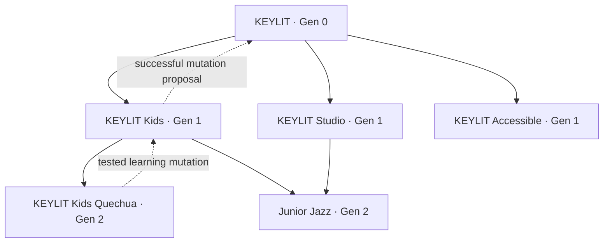
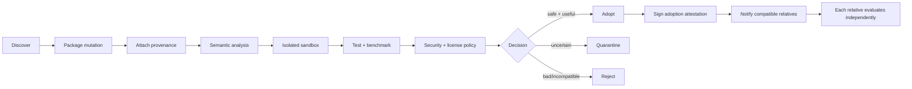
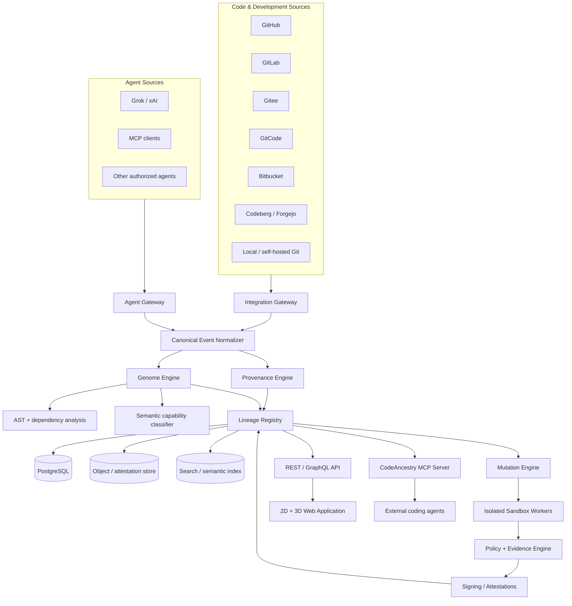

# CodeAncestry: Designing the Lineage Layer for Living Software

## Executive summary

**CodeAncestry should be designed as the semantic ancestry layer above Git, not as another Git hosting service and not as a central warehouse that copies everybody's source code.** GitHub, GitLab, Gitee, GitCode, Bitbucket, Codeberg and local Git repositories should remain authoritative sources for code. CodeAncestry should become the authoritative—or at least interoperable—**lineage graph** that explains where a project came from, what capabilities it inherited, which capabilities mutated, which agents participated, what evidence supports an evolutionary claim, and which descendants subsequently adopted a change.

That distinction is strategically important. W3C PROV already provides a general model for provenance in terms of entities, activities and agents; CycloneDX explicitly includes component *pedigree* covering origins, modifications, commits and diffs; SLSA defines verifiable provenance for produced artifacts; and in-toto records software-supply-chain steps, actors and attestations. CodeAncestry should build **on these standards rather than inventing a competing provenance universe**. Its novel layer would be semantic inheritance: *project genome → genes → gene versions → child projects → agent knowledge → mutation proposals → tested adoption across a family*. citeturn18search3turn18search0turn18search13turn18search2

The strongest visual inspiration comes from real genomics. Google DeepMind's AlphaGenome frames genetic variants as changes whose downstream effects can be predicted; AlphaFold made sophisticated biological computation understandable through striking three-dimensional molecular structures. Ensembl, the UCSC Genome Browser and NCBI Genome Data Viewer demonstrate a second essential pattern: **semantic zoom**, where the same data can be viewed at genome, chromosome, gene, transcript and base-level scales. HiGlass goes even further by treating genomic data like a large multiscale map that users can pan and zoom, while the WashU Epigenome Browser supports 3D genome models. CodeAncestry should combine those paradigms: cinematic 3D for emotional comprehension, multiscale scientific navigation for serious work. citeturn0search0turn0search20turn0search1turn0search2turn0search3turn14search0turn14search9

The initial product should therefore feel something like:

> **AlphaFold's visual confidence + a genome browser's analytical depth + Git's historical truth + a family genealogy + an AI-agent control plane.**

The homepage can make the metaphor unforgettable:

```text
SOURCE CODE
     ↓
 PROJECT GENOME
     ↓
  REPRODUCTION
     ↓
 CHILD PROJECT
     ↓
 LOCAL MUTATION
     ↓
 SANDBOX EVIDENCE
     ↓
 SAFE INHERITANCE
     ↓
 MORE DESCENDANTS
```

But the professional product beneath that metaphor should be rigorous:

```text
GitHub / GitLab / Gitee / GitCode / Bitbucket / Codeberg / local Git
                              │
                              ▼
                   CodeAncestry adapters
                              │
                              ▼
                 Normalized provenance events
                              │
                ┌─────────────┴─────────────┐
                ▼                           ▼
          Project Genome                 Agent DNA
                │                           │
                ├───────────┬───────────────┤
                ▼           ▼               ▼
             Genes      Mutations       Knowledge
                │           │               │
                └───────────┴──────┬────────┘
                                   ▼
                           Lineage Registry
                                   │
                          sandbox + evidence
                                   │
                    Adopt / Reject / Quarantine
```

The recommended first wedge is **AI-native developers and open-source maintainers**, because they already experience the underlying problem: repositories are forked, copied, generated, rewritten and modified by multiple agents, while the semantic reason that one piece of software descends from another becomes increasingly difficult to preserve. Traditional software-product-line research already studies families of related products built from managed common assets, and research on software evolution has long treated changing software as a continuing evolutionary process. CodeAncestry would bring those concepts into a world of autonomous and semi-autonomous coding agents. citeturn8search14turn8search11

The big product thesis is:

> **Git records what changed. CodeAncestry records what was inherited, what evolved, who or what caused it, and where that evolution traveled next.**

And the network thesis is even stronger:

> **CodeAncestry should be the mother graph, not the mother repository.**

That allows GitHub, GitLab, Gitee, GitCode, Bitbucket, Codeberg, future forges, Codex-class agents, Grok, and MCP-compatible systems to coexist without CodeAncestry needing to own their code or their users.

The most defensible early implementation is approximately **three months for a polished GitHub-first MVP**, **three to six months for a v0.2 interoperable protocol**, and **six to twelve months for a v1.0 multi-forge network**, with a team growing from roughly four core contributors to eight–twelve people. These are engineering estimates, not vendor timelines.

The website itself should have three visual layers:

1. **Cinema:** 3D code-DNA hero sequences that explain the thesis in seconds.
2. **Exploration:** interactive family trees, gene maps, agent profiles and lineage timelines.
3. **Evidence:** professional 2D tables, diffs, test matrices, signatures, licenses and attestations.

The key design principle is **not to make everything 3D**. Three-dimensional graphics should make ancestry intuitive; they should never make serious engineering information harder to read.

## From KEYLIT to a software-genome network

### How the idea was born

The strongest origin story for CodeAncestry is not an abstract genetics analogy. It is the practical problem that appeared while thinking about **KEYLIT**.

The initial thought was simple:

> What happens when someone likes KEYLIT but wants to create a specialized version?

Today that normally becomes a fork, copy, template or rewrite:

```text
KEYLIT
   │
   ├── KEYLIT Kids
   ├── KEYLIT Accessibility
   ├── KEYLIT Classroom
   └── KEYLIT Studio
```

The Git model can preserve commit ancestry when a repository remains a fork, but software descendants frequently stop behaving like conventional forks: they diverge heavily, move between hosts, copy selected modules, combine multiple parents, or are regenerated by AI. This makes a pure “fork tree” too narrow for the proposed problem.

Research published in 2026 on cross-forge project provenance reinforces that the platform-native fork graph is not necessarily the complete genealogy of software: a recent project-provenance study used shared commit relations across repositories to recover cross-forge families that platform graphs can miss. That is an important research precedent for treating lineage as independent of any one forge. citeturn12academia29

The second step in the KEYLIT conversation was more important:

> A child should know what it inherited.

So instead of merely recording:

```text
KEYLIT Kids was forked from KEYLIT
```

CodeAncestry would represent:

```text
KEYLIT Kids

Parent
└── KEYLIT @ revision abc123

Inherited genes
├── MIDI Engine       ← KEYLIT
├── Audio Engine      ← KEYLIT
├── Piano Renderer    ← KEYLIT
├── Lesson Engine     ← KEYLIT
└── WebMCP Tools      ← KEYLIT

Local mutations
├── Children's UI
├── Gamification
├── Difficulty adaptation
└── Child-oriented teacher personality
```

Then came the conceptual jump that makes CodeAncestry substantially different from ordinary provenance systems:

> **Every child has an agent, and that agent remains genetically connected to the agents of its ancestors and descendants.**

That creates three overlapping lineages:

```text
PROJECT LINEAGE

KEYLIT
  ├── Kids
  │    └── Kids Quechua
  └── Studio
       └── Producer
```

```text
GENE LINEAGE

adaptive-learning v1
        │
        ├── v1.1 Kids
        │      └── v1.3 Quechua
        │
        └── v1.2 Classroom
```

```text
AGENT / KNOWLEDGE LINEAGE

Guardian A0
    │
    ├── Guardian A1
    │      └── Guardian A3
    │
    └── Guardian A2
```

Those should ultimately form **one directed acyclic provenance graph rather than three isolated trees**, because real software can have multiple parents. A hybrid project could inherit the lesson engine from KEYLIT Kids and the generative-music engine from KEYLIT Studio. CycloneDX's pedigree model is particularly relevant here because it already recognizes complex component scenarios involving ancestors, descendants, variants, modifications and combinations; CodeAncestry can extend the user-facing semantic model without discarding that underlying standard. citeturn18search0turn18search12

### Biology should be the interface metaphor, not the implementation

The biological mapping is surprisingly productive:

| Genetics | CodeAncestry interpretation |
|---|---|
| Organism | Project/release |
| Genome | Complete semantic project manifest |
| Gene | Reusable semantic capability |
| Allele / variant | Gene implementation/version |
| Mutation | Proposed behavioral or implementation change |
| Expression | Whether/how a gene is active in this child |
| Parent | Declared source project/version |
| Descendant | Project inheriting one or more genes |
| Recombination | Multi-parent child/hybrid |
| Fitness | Evidence vector for a mutation in an environment |
| Environment | OS/runtime/browser/hardware/use-case |
| Phenotype | Observable application behavior |
| Genealogy | Project/gene/agent provenance graph |
| Natural selection | Controlled evaluation and adoption |
| Horizontal transfer | Gene adoption by an unrelated project |

The critical discipline is to **stop the analogy where biology stops helping**.

A software mutation can be deliberately reverted. An application can inherit from five parents. A gene can move laterally to an unrelated family. A security fix can be promoted back toward an ancestor. Developers can explicitly choose policies. These properties make software evolution fundamentally engineered rather than natural.

So the technical primitives should be ordinary, inspectable computer-science objects:

```text
immutable identifiers
Git revisions
content hashes
AST relationships
module boundaries
dependency graphs
test results
licenses
provenance edges
signed attestations
policy decisions
agent-generated structured summaries
```

### The project genome

I recommend defining a human-readable protocol object called `genome.json`.

An illustrative v0.2 form:

```json
{
  "$schema": "https://schemas.codeancestry.com/genome/v0.2.json",
  "project": "ca:project:keylit-kids",
  "version": "git:revision:abc123",
  "parents": [
    {
      "project": "ca:project:keylit",
      "revision": "def456",
      "relationship": "child",
      "confidence": 1.0
    }
  ],
  "genes": [
    {
      "id": "ca:gene:midi-engine",
      "version": "3.2.0",
      "origin": "ca:project:keylit",
      "inheritance": "inherited",
      "expression": "active"
    },
    {
      "id": "ca:gene:gamification",
      "version": "1.0.0",
      "origin": "ca:project:keylit-kids",
      "inheritance": "local-mutation",
      "expression": "active"
    }
  ],
  "policies": {
    "ancestorUpdates": "proposals-only",
    "knowledgeSharing": "family"
  },
  "attestations": []
}
```

A major design rule should be:

**The logical gene ID remains stable; each implementation/version is immutable.**

Without that distinction, renames and implementation rewrites would destroy lineage. A gene such as `adaptive-lesson-planning` should be able to survive across JavaScript, Rust, Swift or a model-backed implementation while its individual versions remain precisely identifiable.

Gene discovery should also carry **confidence and evidence**. CodeAncestry should never pretend that an LLM's guess that two modules are “the same gene” is equivalent to a declared relationship.

For example:

```text
Gene: adaptive-lesson-planning

Identity evidence
────────────────────────────────
Declared manifest             HIGH
Shared API contract           HIGH
Shared tests                  HIGH
AST structural similarity     MEDIUM
Shared commits                HIGH
LLM semantic similarity       SUPPORTING
Name similarity               LOW
```

This leads to an important distinction:

> **Declared ancestry and inferred ancestry must be separate.**

A maintainer saying “this project is a child of KEYLIT” is a first-class assertion. CodeAncestry may separately infer that another project appears related because it shares commit history, APIs or structure—but that inference should be labeled, scored and challengeable.

### Agent DNA

`agent-dna.json` should not be a dump of an AI conversation or hidden chain-of-thought. It should contain the **operational heredity of the project's guardian agent**: identity, permissions, ancestry, policies, capabilities and references to structured knowledge artifacts.

For example:

```json
{
  "$schema": "https://schemas.codeancestry.com/agent-dna/v0.2.json",
  "agent_id": "ca:agent:keylit-kids-guardian",
  "project": "ca:project:keylit-kids",
  "inherits_from": [
    "ca:agent:keylit-guardian"
  ],
  "capabilities": [
    "analyze",
    "propose-mutation",
    "run-approved-tests"
  ],
  "knowledge_policy": {
    "share": "family",
    "share_raw_prompts": false,
    "share_private_reasoning": false
  },
  "knowledge_refs": [
    "ca:knowledge:midi-safari-buffering-17"
  ],
  "trust": {
    "signatures_required": true
  }
}
```

The distinction between **agent identity** and **model provider** matters. A project's guardian might be run by Grok today and another compatible model tomorrow. The agent's lineage should not disappear because its inference provider changed.

MCP is highly relevant here. The current 2026-07-28 MCP specification describes an open protocol connecting LLM applications to external data sources and tools, and its current roadmap emphasizes agentic messaging, identity and enterprise security. CodeAncestry should therefore expose its registry and mutation operations through MCP instead of requiring every AI vendor to implement a proprietary integration. citeturn17search1turn17search9

That could let an authorized coding agent ask:

```text
codeancestry.get_genome(project)
codeancestry.get_ancestors(project)
codeancestry.find_gene(gene_id)
codeancestry.find_compatible_mutations(gene_id)
codeancestry.propose_mutation(...)
codeancestry.request_sandbox(...)
codeancestry.get_attestations(mutation)
codeancestry.adopt_mutation(...)
```

The remarkable outcome is that the same CodeAncestry family could be worked on through many AI systems without making any one model company the keeper of the genealogy.

## Product vision, users and core experience

### The right market position

The strongest positioning is:

> **CodeAncestry is the lineage layer for living software.**

I would avoid positioning it as:

> “The place where all source code lives.”

That invites an unnecessarily difficult battle with GitHub, GitLab and every regional forge, while also multiplying copyright, storage, confidentiality and geopolitical problems.

The architecture should instead be:

```text
                  CODE SOURCES

 GitHub   GitLab   Gitee   GitCode   Bitbucket   Codeberg
    \       |       |        |          |          /
     \      |       |        |          |         /
      └─────┴───────┴────────┴──────────┴────────┘
                         │
                         ▼
                  CODEANCESTRY
                "the mother graph"
                         │
        ┌────────────────┼────────────────┐
        ▼                ▼                ▼
   Genome Registry   Gene Registry   Agent Lineage
        │                │                │
        └────────────────┼────────────────┘
                         ▼
              mutation/evidence network
```

The forges remain the **source of code truth**. CodeAncestry becomes the **source of lineage truth/evidence**.

### Target users

The initial customer/user ordering should be:

| User | Pain | CodeAncestry value | Priority |
|---|---|---|---|
| AI-native developers | Multiple agents modify projects without unified semantic provenance | Agent DNA + mutation history + explainable inheritance | **First** |
| Open-source maintainers | Fork ecosystems diverge and useful improvements get stranded | Descendant discovery + upstream mutation proposals | **First** |
| Platform/DevSecOps teams | Need provenance, policy and visibility across repos/forges | Signed lineage + evidence + cross-forge registry | High |
| Product-line engineering | Related products share common capabilities but evolve separately | Explicit genes/variants/inheritance | High |
| Enterprise architecture | Multiple acquisitions/teams create duplicated code lineages | Cross-repository ancestry discovery | Medium |
| Robotics/embedded teams | Long-lived products need traceable behavioral ancestry | Deep software genealogy | Later |
| Researchers | Need software evolution datasets and graphs | Public lineage API/export | Later |

Software product-line engineering is a particularly strong precedent because the Software Engineering Institute formalized the idea of creating related products using managed common features and reusable core assets. CodeAncestry differs by making those relationships explicit across Git histories, AI agents and independently evolving descendants. citeturn8search14turn8search2

### The central user journey

The MVP should make the first experience almost absurdly easy:

```text
Connect GitHub
      ↓
Choose repository
      ↓
"Sequencing your code..."
      ↓
Genome generated
      ↓
See genes
      ↓
See ancestry
      ↓
Create Child
```

The “sequencing” experience can be visually beautiful, but the result must explain how conclusions were reached.

For KEYLIT:

```text
Sequencing KEYLIT...

✓ 326 TypeScript modules indexed
✓ dependency relationships mapped
✓ exported APIs indexed
✓ tests associated
✓ commit ancestry indexed
✓ semantic capabilities proposed
✓ provenance sources linked

PROJECT GENOME READY
```

The exact numbers above would of course come from the actual repository; they are illustrative UI content, not current facts.

### Core product surfaces

**Genome Explorer** answers “What am I?”

```text
KEYLIT / Genome

Core genes
├── MIDI Input
├── Audio Engine
├── Piano Renderer
├── Lesson Engine
├── AI Teacher
└── Tool Interface

Origin makeup
██████████████████  Original
███                 inherited
█                   external

Genome confidence: 94%
```

**Lineage Explorer** answers “Where did I come from and where did I go?”



Notice that `Junior Jazz` has two parent edges. **That is why the technical model is a DAG, not a literal family tree.**

**Gene Registry** answers “Where did this capability originate and how has it evolved?”

```text
GENE G-000109

Adaptive Lesson Planning

Origin
KEYLIT / 2026 / Generation 0

Current stable variant
G-000109.37

Known descendants
1,842

Projects expressing gene
4,311

Mutations
83

Verified adaptations
29

Evidence
✓ unit tests
✓ integration tests
✓ signed provenance
✓ sandbox benchmark
✓ license metadata
```

Those counts are illustrative future UI values.

**Child/Baby Project Page** is where the genetics idea becomes memorable without sacrificing professionalism:

```text
┌──────────────────────────────────────────────────────────────┐
│ DIGITAL BIRTH RECORD                                         │
│                                                              │
│ KEYLIT KIDS                                                  │
│ Born from KEYLIT @ def456                                    │
│                                                              │
│ Parents                                                      │
│ KEYLIT                                                       │
│                                                              │
│ Inherited                                                    │
│ 72% declared genes                                           │
│                                                              │
│ New mutations                                                │
│ Gamification · Child UI · Beginner feedback                  │
│                                                              │
│ Guardian Agent                                               │
│ Kids Guardian A1                                             │
│                                                              │
│ Birth attestation                                            │
│ VERIFIED ✓                                                   │
└──────────────────────────────────────────────────────────────┘
```

I would call it **Birth Record** in the consumer/demo experience and **Project Origin Attestation** in enterprise/API terminology.

**Agent Profile** answers “What does my guardian know, and where did that knowledge come from?”

```text
AGENT A37 — KEYLIT Kids Guardian

Agent ancestry
A0 → A7 → A19 → A37

Inherited knowledge artifacts      47
Local validated discoveries        12
Shared upstream                     4
Adopted by descendants              7

Permissions
✓ analyze
✓ propose mutation
✓ request sandbox
✗ production merge without approval

Knowledge policy
Family only
```

**Mutation Lab** is probably the most commercially important screen because it turns the metaphor into engineering workflow:

```text
MUTATION M-8382
Safari MIDI Scheduling Adaptation

Origin
KEYLIT Kids Norway

Affected gene
MIDI Timing G-018

Semantic impact
Scheduling strategy

Compatibility
96 / 101 relatives candidate-compatible

Sandbox
✓ Chrome
✓ Safari
✓ Firefox
✓ Windows
✓ macOS
! iOS manual review

Security
✓ dependency scan
✓ secrets scan

License
✓ compatible

Fitness delta
Latency       +18%
CPU           +7%
Regression     0 detected

[ADOPT] [QUARANTINE] [REJECT]
```

Again, these values are interface examples.

### Fitness should be a vector, not one magical score

Real genetic fitness makes a powerful metaphor, but software does not have one universal objective.

A mutation can improve performance while degrading maintainability. It can improve accessibility while increasing bundle size. Therefore, CodeAncestry should represent fitness as an evidence vector:

\[
F(m,e)=
w_tT+
w_sS+
w_pP+
w_cC+
w_uU-
R
\]

where, conceptually:

- \(T\): test correctness,
- \(S\): security evidence,
- \(P\): performance,
- \(C\): compatibility,
- \(U\): user/product objective,
- \(R\): regression/risk penalties,
- \(e\): the target environment.

The weights must belong to the receiving project's policy. The network should never globally declare that one mutation is “genetically superior.”

### The mutation lifecycle

This should become one of CodeAncestry's signature diagrams:



in-toto already provides an attestation framework capable of binding statements to specific artifact digests, and its test-result predicate is explicitly designed to attest that required tests ran and passed. That makes it a natural foundation for CodeAncestry's mutation evidence rather than creating an unverifiable homemade “98% safe” badge. citeturn18search10turn18search18

The governing principle should be:

> **Knowledge can propagate. Authority does not.**

A descendant can tell its grandfather that it discovered a better implementation. It cannot silently rewrite its grandfather.

## Architecture, integrations, provenance and trust

### Reference architecture



### Integration strategy

The adapters should normalize each provider into a common model:

```text
Repository
Revision
Branch/tag
Commit
Merge request / pull request
Fork declaration
Contributor/agent
Webhook event
Build
Test
Release
Artifact
```

GitHub should be first. GitHub Apps support granular permissions and built-in webhook subscriptions; GitHub's own documentation explicitly recommends selecting the minimum permissions necessary, and GitHub Apps have centralized webhook handling compared with traditional OAuth Apps. citeturn15search0turn15search12turn15search18

GitLab provides OAuth 2.0, multiple API token types, REST APIs and project/group webhooks, including self-managed deployments; this makes it an important second integration because it extends CodeAncestry beyond a single SaaS forge. citeturn15search4turn15search13turn15search1turn15search16

Bitbucket Cloud provides REST APIs, OAuth 2.0, scoped API tokens and repository/workspace webhooks. Atlassian's current REST documentation exposes webhook operations and corresponding scopes. citeturn16search0turn16search5turn16search4turn16search7

Gitee exposes an official API v5 endpoint and should be a first-class China-region adapter rather than treated as an exotic edge case. citeturn16search2 GitCode likewise publishes an API documentation surface, including API, OAuth and webhook capabilities, making it technically realistic to normalize into the same integration gateway. citeturn7search0turn7search22turn7search2

Codeberg uses Forgejo and documents repository webhooks, giving CodeAncestry an important open/noncommercial-forge path and an implementation model that can later generalize to other Forgejo installations. citeturn16search3

For Grok, the correct model is not “read Grok's private memory.” xAI currently exposes APIs with function calling, allowing an application to define functions the model requests while the application itself executes them; its Grok Build coding agent can also operate headlessly and through agent protocols. That is sufficient for CodeAncestry to expose controlled mutation and genome tools to a Grok-based agent without requiring access to any hidden internal provider data. citeturn17search0turn17search2turn17search10

The same principle should govern every AI provider:

> **CodeAncestry stores authorized lineage artifacts produced through public interfaces—not inaccessible private model internals.**

### OAuth, tokens and webhooks

| Method | Best use | Advantages | Weakness | Recommendation |
|---|---|---|---|---|
| **GitHub App / OAuth** | User installs CodeAncestry on selected repositories | User consent, revocable, scoped access | More setup than PAT | **Primary** |
| **OAuth 2.0** | GitLab, Bitbucket and supported forges | Professional onboarding, delegated access | Provider-specific scopes/flows | **Primary** |
| **Personal/API token** | Self-hosted, Gitee/GitCode/Codeberg beta, advanced users | Fast integration, broad compatibility | Secret handling burden and user friction | **Fallback** |
| **Webhook** | Continuous synchronization | Real-time changes without constant polling | Must authenticate, deduplicate and handle retries | **Always complement API auth** |
| **Git clone/fetch** | Commit/object-level ancestry | Vendor-neutral Git truth | Potentially expensive/private | Selective/ephemeral |
| **Periodic API reconciliation** | Correct missed webhook events | Eventual consistency | Additional calls | Background safety net |

The recommended ingest algorithm is:

```text
OAuth/App authorization
        ↓
Initial API metadata snapshot
        ↓
Selective Git history fetch
        ↓
Genome generation
        ↓
Subscribe to webhooks
        ↓
Process incremental events
        ↓
Periodic reconciliation
```

Webhook integrity has to be treated seriously from the first MVP. GitHub, for example, signs webhook payloads using a secret and the `X-Hub-Signature-256` header and recommends validating deliveries rather than trusting incoming HTTP requests. citeturn14search3turn14search23

### Data model

The MVP should use **PostgreSQL as the primary transactional database**, despite the product visually looking like a graph.

Recommended primary entities:

| Entity | Purpose |
|---|---|
| `Project` | Stable software-family identity |
| `ProjectVersion` | Immutable revision/release |
| `SourceRef` | Forge/repository/commit location |
| `Gene` | Stable semantic capability identity |
| `GeneVersion` | Immutable gene implementation |
| `Expression` | Gene enabled/replaced/disabled within project |
| `InheritanceEdge` | Parent → child relationship |
| `MutationProposal` | Candidate change |
| `AdoptionEvent` | Project accepts/rejects/quarantines mutation |
| `AgentIdentity` | Persistent project-agent identity |
| `AgentRun` | Specific model/provider execution |
| `KnowledgeArtifact` | Shareable structured lesson |
| `Evidence` | Tests, benchmarks, analysis |
| `Attestation` | Signed claim about evidence/action |
| `SandboxRun` | Isolated evaluation |
| `IntegrationAccount` | Authorized forge/provider connection |
| `Policy` | Sharing/adoption/security policy |

Postgres is preferable at first because the hardest MVP problems are product semantics, identity resolution, integrations and trust—not billion-node traversal. Project ancestry can be represented with edge tables and recursive queries. A dedicated graph engine can be evaluated later if traversal workload proves to require it; starting with a graph database simply because the user interface is a graph would be premature architecture.

Large signed documents, SBOMs, diffs and test logs belong in an **object store**. Searchable descriptions can be indexed separately. Private source code should normally remain at the forge and only be cloned ephemerally when analysis is explicitly authorized.

### Semantic “genes”

Automatic gene extraction is the riskiest technical assumption, so the MVP should use several layers of evidence:

```text
package/module boundaries
        +
dependency graph
        +
public API surface
        +
tests
        +
commit history
        +
AST structure
        +
maintainer declarations
        +
LLM semantic labeling
```

Tree-sitter is well suited to cross-language structural parsing because it produces syntax trees and supports incremental parsing; for TypeScript specifically, `ts-morph` offers a convenient layer over the TypeScript compiler API. GumTree is an established AST-differencing approach and is useful inspiration for structural change detection. citeturn9search0turn9search5turn9search4

I would therefore define **semantic merge** as a CodeAncestry pipeline, not as an LLM instruction:

```text
Git diff
   +
AST diff
   +
dependency impact
   +
gene boundary
   +
test ownership
   +
LLM explanation
   +
sandbox
   =
semantic mutation proposal
```

The LLM explains and proposes. Deterministic tools and tests provide evidence.

### Existing provenance standards should become the skeleton

A strong protocol mapping could be:

| CodeAncestry | Standard foundation |
|---|---|
| Project/gene/agent provenance | **W3C PROV** |
| Component ancestry/pedigree | **CycloneDX** |
| Build/source integrity | **SLSA v1.2** |
| Mutation/build/test claims | **in-toto attestations** |
| Signing/transparency | **Sigstore** |
| AI tool interface | **MCP** |

W3C PROV is especially natural because its conceptual model already distinguishes entities, activities and agents and was explicitly designed for interoperable provenance exchange. citeturn18search7turn18search26

CycloneDX is almost startlingly close to part of the CodeAncestry thesis: its current pedigree model documents component origin and evolution, including modifications, commits and diffs, and CycloneDX 1.7 even illustrates lineage for machine-learning models through ancestor relationships. CodeAncestry's opportunity is therefore *not* “invent pedigree,” but to add semantic genes, living project relationships, agent knowledge propagation and an interactive network on top. citeturn18search0turn18search20

SLSA 1.2 provides an appropriate framework for artifact/source provenance and supply-chain integrity. citeturn18search1turn18search17 in-toto supplies extensible signed statements about steps and test results. citeturn18search2turn18search18 Sigstore offers infrastructure to sign and verify software artifacts and uses transparency-log-based mechanisms, which could later support publicly verifiable mutation/adoption records where privacy permits. citeturn14search10turn14search14

This creates a much stronger investor and engineering pitch:

> CodeAncestry isn't trying to replace provenance standards.  
> **It makes provenance evolutionary, semantic and explorable.**

## Experience, three-dimensional design and genomic inspiration

### What we should learn from real genome products

Several genomics interfaces contain directly transferable ideas.

**Google DeepMind AlphaGenome** is useful conceptually because it treats a variant not merely as a textual difference but as something whose effects across biological processes need interpretation. CodeAncestry's Mutation Lab should similarly ask “what is the likely consequence of this code mutation?” rather than “which lines changed?” citeturn0search0

Design inspiration:  
`https://deepmind.google/blog/alphagenome-ai-for-better-understanding-the-genome/`

**AlphaFold** is the strongest inspiration for the homepage's emotional layer. Its public presentation turned complex molecular structures into recognizable three-dimensional objects. CodeAncestry can achieve the same effect with a digital helix built from modules, commits and agent events. citeturn0search20

Design inspiration:  
`https://deepmind.google/science/alphafold/`

**UCSC Genome Browser** is a better inspiration for the actual application. It allows navigation from broad chromosome-level context toward increasingly detailed genomic tracks. The project's own historical description uses the analogy of a microscope with multiple powers. CodeAncestry should implement the same idea for software ancestry. citeturn0search6turn0search10

Design inspiration:  
`https://genome.ucsc.edu/`

**Ensembl** demonstrates how gene/transcript data and genomic annotation can become a serious research interface rather than a decorative DNA visualization. Its Variant Effect Predictor is particularly analogous to a future CodeAncestry Mutation Effect Predictor. citeturn0search1turn0search17

Design inspiration:  
`https://www.ensembl.org/`

**NCBI Genome Data Viewer** demonstrates the importance of combining reference sequences, annotations and variation into one browser rather than separating them into disconnected tools. citeturn0search3

Design inspiration:  
`https://www.ncbi.nlm.nih.gov/gdv/`

**WashU Epigenome Browser** supports viewing 3D genome models, making it an excellent inspiration for a dedicated “immersive lineage” mode. citeturn14search0

Design inspiration:  
`https://epigenomegateway.wustl.edu/`

**HiGlass** is especially relevant at scale. Its documentation describes a fast multiscale data viewer inspired by genome browsers and online slippy maps. That is almost exactly how a million-node CodeAncestry network should eventually behave: zooming reveals increasingly fine detail rather than trying to render everything simultaneously. citeturn14search9turn14search13

Design demos:  
`https://higlass.io/`  
`https://higlass.io/examples`

### The CodeAncestry visual language

I would use a **scientific-futuristic visual system**, not a neon cyberpunk website.

The visual hierarchy:

```text
BLACK / NEAR-BLACK SPACE
        │
        ├── restrained luminous genome strands
        ├── precise typography
        ├── scientific coordinate labels
        ├── lineage nodes
        ├── evidence indicators
        └── subtle depth / particle movement
```

The main metaphor should be:

**Code is DNA, but evidence is science.**

The hero can begin with a realistic-looking double helix, but when the visitor moves the mouse or scrolls, its “base pairs” reveal themselves as code abstractions:

```text
{}
()
<>
01
SHA
API
AST
TEST
MCP
```

Then it splits:

```text
                    KEYLIT
                       🧬
                        │
             ┌──────────┴──────────┐
             │                     │
          KEYLIT Kids          KEYLIT Studio
             🧬                     🧬
             │                     │
        ┌────┴────┐                │
        │         │                │
     Quechua   Junior Jazz─────────┘
```

Finally, particles representing “knowledge mutations” travel back through selected edges.

That twenty-second animation explains the entire company.

### Home page cinematic sequence

The page should be scroll-driven.

**Opening state**

A single floating 3D helix.

```text
CODEANCESTRY

Every machine has ancestors.

Trace what your software inherited,
what it changed,
and what it passes on.
```

**First scroll**

Camera approaches a base pair. It becomes:

```text
GENE G-018
MIDI Scheduling
origin: KEYLIT
```

**Second scroll**

Helix stretches into a horizontal genomic track:

```text
CORE ───── MIDI ───── AUDIO ───── TEACHER ───── LESSONS
```

**Third scroll**

Genome replicates.

```text
                  KEYLIT
                    │
          ┌─────────┴─────────┐
          ▼                   ▼
        Kids                Studio
```

**Fourth scroll**

The children mutate.

```text
Kids
+ Gamification
+ Adaptive difficulty

Studio
+ Composition
+ Generative accompaniment
```

**Fifth scroll**

A successful mutation becomes a glowing packet and travels back upstream.

```text
Kids Norway
    ↑
Adaptive MIDI Buffering
    ↑
KEYLIT Kids
    ↑
KEYLIT
```

**Sixth scroll**

Zoom out dramatically. KEYLIT becomes one tiny family among millions:

```text
GitHub      GitLab      Gitee      GitCode
    \          |          |           /
     \         |          |          /
             CODEANCESTRY
              LIVING GRAPH
        /         |        |       \
 Bitbucket     Codeberg   Git     Agents
```

Then:

> **Connect your first ancestor.**

### Lineage Explorer

This should be the signature application screen.

Desktop wireframe:

```text
┌────────────────────────────────────────────────────────────────────┐
│ CodeAncestry       Search genome / project / gene...        user   │
├──────────────┬──────────────────────────────────────┬──────────────┤
│ FILTERS      │                                      │ INSPECTOR    │
│              │             FAMILY GRAPH             │              │
│ Forge        │                                      │ KEYLIT Kids  │
│ ☑ GitHub     │     ○ KEYLIT                         │ Gen 1        │
│ ☑ GitLab     │       ╱   ╲                          │              │
│ ☑ Gitee      │      ○     ○                         │ Parent       │
│              │    Kids   Studio                     │ KEYLIT       │
│ Generation   │      ╲     ╱                         │              │
│ 0 ───── 20   │       ○ Hybrid                       │ 82% inherited│
│              │                                      │ 18% mutated  │
│ Genes        │                                      │              │
│ MIDI         │                                      │ Agent A17    │
│ Teacher      │                                      │ Verified ✓   │
│              │                                      │              │
├──────────────┴──────────────────────────────────────┴──────────────┤
│ timeline:  2026 ───────────────────────────────────────── 2032     │
└────────────────────────────────────────────────────────────────────┘
```

Zoom levels should work like a genome browser:

```text
NETWORK
   ↓
FAMILY
   ↓
PROJECT
   ↓
GENOME
   ↓
GENE
   ↓
GENE VERSION
   ↓
MUTATION
   ↓
AST / COMMIT / TEST / ATTESTATION
```

That is one of the most important UX ideas in this report.

### Which pages should actually use 3D

| Page | 3D? | What it should show |
|---|---:|---|
| Homepage | **Yes, major** | Code helix reproducing into lineage |
| Project Genome | **Yes, optional** | Genome strand / capability architecture |
| Gene Detail | **Yes, focused** | Gene-version evolution and mutation segments |
| Lineage Explorer | **Hybrid 2D/3D** | Optional spatial family mode; 2D default |
| Mutation Lab | No | Diff, test matrix, evidence must stay precise |
| Agent Profile | Light | Agent knowledge connections, not decorative avatar |
| Integrations | No | Professional connection/status UI |
| Settings/security | No | Conventional accessible controls |
| Registry overview | Optional | Large network “galaxy” as exploration mode |

The professional default should always have a 2D alternative for accessibility, mobile performance and precise navigation.

### Visualization technology comparison

| Technology | Best CodeAncestry job | Strength | Weakness | Recommendation |
|---|---|---|---|---|
| **Three.js** | Raw 3D genome/network engine | Mature WebGL/WebGPU ecosystem | Imperative complexity | Core 3D foundation |
| **React Three Fiber** | React-based 3D scenes | React renderer for Three.js, component model | Requires 3D/WebGL expertise | **Primary 3D UI layer** |
| **D3** | Family trees, DAG layouts, axes, semantic zoom | Excellent hierarchy, force and data transformations | Not a 3D engine | **Primary data-vis/layout** |
| **deck.gl** | Massive GPU-driven network/data layers | Designed for large composable GPU layers | Overkill for first family tree | v1 scale tool |
| **GSAP** | Cinematic scroll sequencing | Controls DOM/SVG/Three.js timelines | Additional animation layer | **Homepage storytelling** |
| **Lottie** | Lightweight decorative loops/icons | Designer-friendly JSON animation | Poor for live data-driven lineage | Marketing micro-animation |
| **Motion** | UI transitions | React gestures/layout/scroll | Not specialized graph rendering | Product micro-interactions |

Three.js exposes browser 3D rendering primitives and a broad scene/animation ecosystem, while React Three Fiber is a React renderer for Three.js. citeturn1search0turn1search5 D3 remains particularly appropriate for hierarchy and graph layouts. citeturn2search0turn2search19 deck.gl is designed around GPU-accelerated composable visualization layers and becomes attractive once lineage graphs reach much larger scales. citeturn1search3 Lottie is designed around portable animation data exported from animation workflows, while GSAP can animate DOM, SVG and 3D-related properties and is better suited to a choreographed landing-page sequence. citeturn2search1turn2search2

My actual production stack would therefore be:

```text
React / Next-style frontend
        │
        ├── React Three Fiber + Three.js
        │      hero + immersive genome
        │
        ├── D3
        │      hierarchy + lineage layouts
        │
        ├── GSAP
        │      homepage cinematic scroll
        │
        └── Motion
               normal UI transitions
```

Do **not** install every shiny visualization package on day one.

### Gene cards should look like scientific specimens

```text
╭─────────────────────────────────────────────╮
│ G-000018                         VERIFIED ✓ │
│ MIDI SCHEDULING                            │
│                                             │
│ Origin                                      │
│ KEYLIT · 2026                               │
│                                             │
│ Variant                                     │
│ 3.7.2                                       │
│                                             │
│ Inherited by                                │
│ 1,429 projects                              │
│                                             │
│ ─── FITNESS ──────────────────────────────   │
│ correctness        100%                     │
│ compatibility       97%                     │
│ security             A                      │
│                                             │
│ Latest mutation                             │
│ Adaptive Safari Buffering                   │
│                                             │
│ [Explore ancestry]   [View mutations]       │
╰─────────────────────────────────────────────╯
```

The look should suggest “scientific evidence,” not NFT trading cards.

## Roadmap, hosting, security, governance and metrics

### Prioritized implementation roadmap

The first year should deliberately postpone the global science-fiction network until the underlying identities and trust model work.

| Phase | Time | Deliverables | Team | Effort estimate | Exit criterion |
|---|---|---|---|---:|---|
| **MVP** | Weeks 0–12 | GitHub App, repo ingestion, `genome.json`, declared genes, AI-assisted gene suggestions, KEYLIT Gen-0 demo, D3 lineage, project/gene pages, Create Child, basic sandbox | Founder/PM; tech lead; frontend/vis engineer; backend engineer; fractional designer/security | ~35–45 person-weeks | User connects repo → sees useful genome → creates first traced child |
| **Protocol v0.2** | Months 3–6 | `agent-dna.json`, mutation schema, knowledge artifacts, W3C/CycloneDX mappings, SLSA/in-toto evidence, GitLab + Gitee + GitCode + Bitbucket + Codeberg adapters, MCP server, semantic diff, 3D experience | 5–7 people | ~70–100 person-weeks | One mutation can be proposed, tested, signed and safely adopted across two independent children |
| **Network v1.0** | Months 6–12 | Public/private gene registry, cross-forge identities, multi-parent children, agent-to-agent proposals, trust/reputation, organization policies, SDK, enterprise controls, network analytics | 8–12 people | ~180–260 person-weeks | Useful verified mutations propagate across unrelated organizations/forges without manual lineage reconstruction |

These are planning estimates; semantic gene extraction and cross-forge identity resolution are the largest uncertainty multipliers.

### MVP priorities

The most important thing **not** to do is spend three months only building the gorgeous 3D website.

The MVP order should be:

```text
1. Stable project identity
        ↓
2. GitHub ingest
        ↓
3. genome.json
        ↓
4. Explicit + suggested genes
        ↓
5. lineage edges
        ↓
6. Create Child
        ↓
7. mutation proposal
        ↓
8. sandbox + evidence
        ↓
9. beautiful 3D storytelling
```

The 3D homepage is useful for pitching. The lineage protocol is the company.

### Subdomain structure

Your Cloudflare screenshot showed `codeancestry.com` active in the account. I would establish this namespace immediately:

| Domain | Purpose | Launch |
|---|---|---|
| `codeancestry.com` | Brand, story, interactive public demo | MVP |
| `app.codeancestry.com` | Authenticated application | MVP |
| `api.codeancestry.com` | REST/GraphQL API | MVP |
| `docs.codeancestry.com` | API + protocol documentation | MVP |
| `registry.codeancestry.com` | Public/private gene and lineage registry | v0.2 |
| `mcp.codeancestry.com` | MCP endpoint/discovery | v0.2 |
| `research.codeancestry.com` | Paper, benchmarks, datasets | v0.2 |
| `status.codeancestry.com` | Service status | Before paid launch |
| `lab.codeancestry.com` | Experimental 3D/network demos | Optional |

Don't launch nine empty subdomains simultaneously. Reserve them in DNS and expose only the first four until they contain real content.

### Hosting comparison

| Platform | Strength for CodeAncestry | Limitation | Role |
|---|---|---|---|
| **Cloudflare Workers** | Domain already on Cloudflare; edge app/API platform; current Cloudflare guidance positions Workers as the primary platform for new app use cases | Not where I would execute arbitrary untrusted repositories | **Recommended front door/API** |
| **Vercel** | Excellent React/Next deployment and preview workflow | Additional vendor/control plane | Excellent alternative frontend |
| **Netlify** | Git-centric deploys, previews, functions; deploy APIs suit automated workflows | Same separation required for heavy sandbox jobs | Good alternative |
| **GitHub Actions** | Native CI around GitHub repositories | CI system, not primary application hosting | **Recommended CI** |
| **Isolated container workers** | Correct environment for compiling/testing untrusted code with quotas | More operational complexity | **Required mutation sandbox** |

Cloudflare's August 2026 documentation states that Workers now covers most Pages use cases and recommends new projects start with Workers. citeturn10search8turn10search12 GitHub Actions provides repository-native workflow automation and is a straightforward initial CI system. citeturn10search3 Vercel and Netlify remain good frontend alternatives, and Netlify explicitly provides programmable deployment capabilities. citeturn10search1turn10search26

My initial deployment would be:

```text
Cloudflare DNS
     │
Cloudflare Workers
     ├── website
     ├── authenticated API gateway
     └── webhook receivers
              │
              ▼
       managed PostgreSQL
              │
         object storage
              │
              ▼
     isolated job/sandbox queue
              │
              ▼
       ephemeral containers

GitHub Actions
     └── test + build + deploy CodeAncestry itself
```

**Never execute arbitrary connected repository code directly in the web/API process.**

### Security and privacy checklist

The following should be launch requirements rather than future enterprise polish.

| Area | Required control |
|---|---|
| Repository access | Least-privilege OAuth/App scopes; explicit repository selection |
| Tokens | Encrypt at rest; rotate; never log; use short-lived tokens where provider supports them |
| Webhooks | Verify provider signature/secret; replay protection; idempotency |
| Tenant isolation | Organization/project authorization on every object |
| Private code | Metadata-only by default where practical; ephemeral clone for analysis |
| Sandbox | No outbound network by default; CPU/RAM/time quotas; ephemeral filesystem |
| Secrets | Never expose production credentials to analyzed code |
| Agent tools | Capability-scoped operations; no unrestricted shell by default |
| Knowledge sharing | Explicit policy: private/family/org/public |
| Agent memory | Structured evidence/summary only; no hidden reasoning or raw private prompts by default |
| Mutation propagation | Proposal only; recipient independently evaluates |
| Builds | Provenance and artifact hashes |
| Dependencies | CycloneDX SBOM and pedigree where relevant |
| Tests | Signed/linked test evidence |
| Security-sensitive genes | Human approval required |
| Licensing | Origin + license gate before cross-project adoption |
| Deletion | Export/delete controls for private account data |
| Auditability | Immutable event history/attestations |
| Incident response | Quarantine, revoke and rollback mutation/gene versions |
| Transparency | Public log only for artifacts explicitly designated public |

GDPR principles are highly relevant to European users: personal data should be purpose-limited, minimized, retained only as necessary and protected appropriately. citeturn11search7 This strongly supports the architecture of storing lineage metadata rather than indiscriminately warehousing repository and agent conversation contents.

### Governance for agents learning from one another

This is the most important safety model in the product.

**Agents should not “teach each other” by exchanging uncontrolled memory blobs.**

They exchange **Knowledge Artifacts**:

```json
{
  "knowledge_id": "ca:knowledge:adaptive-buffering-017",
  "origin_project": "ca:project:keylit-kids-no",
  "gene": "ca:gene:midi-scheduling",
  "claim": "Adaptive buffer reduced Safari timing variance",
  "mutation_ref": "ca:mutation:8382",
  "environment": {
    "browser": "Safari"
  },
  "evidence_refs": [
    "ca:test-run:81231",
    "ca:benchmark:1828"
  ],
  "confidence": 0.93,
  "sharing": "family"
}
```

The receiving agent asks:

```text
Is this gene related to mine?
        ↓
Is this knowledge authorized for me?
        ↓
Can I reproduce the evidence?
        ↓
Does the license permit adoption?
        ↓
Does it pass my policy?
        ↓
Does it pass my sandbox?
        ↓
PROPOSE — never silently merge
```

Federated learning is a useful conceptual precedent because it demonstrates learning from distributed participants without simply centralizing all raw local data; secure aggregation research similarly explores privacy-preserving combination of distributed updates. However, CodeAncestry should borrow the **privacy and distributed-learning principle**, not equate software patches with model gradients. citeturn8search1turn8search13

Governance tiers:

```text
PRIVATE
Only this project

FAMILY
Declared ancestors + descendants

ORGANIZATION
Projects controlled by same organization

FEDERATION
Trusted partner organizations

PUBLIC
Registry-wide discoverability
```

Every project retains **genomic sovereignty**:

> An ancestor cannot force a descendant to update.  
> A descendant cannot force an ancestor to accept a mutation.  
> A network reputation score never overrides local policy.

### Metrics and KPIs

Do not build an investor dashboard around “number of genes created.” That can be gamed instantly.

The meaningful metrics fall into five families.

| Dimension | KPI | Why it matters |
|---|---|---|
| **Activation** | Connected repo → completed genome rate | Is sequencing useful? |
| | Genome → first lineage exploration | Does ancestry create value? |
| | Genome → first Child | Does reproductive workflow work? |
| **Lineage quality** | Precision of known ancestry edges | Are relationships trustworthy? |
| | Provenance completeness | How much lineage has evidence? |
| | Declared vs inferred confirmation rate | Is inference actually helpful? |
| **Mutation quality** | Proposal → adoption rate | Agent recommendation precision |
| | Regression escape rate | Are bad mutations getting through? |
| | Reproduction success rate | Can other environments reproduce claimed gains? |
| | Rollback/quarantine rate | Health/safety indicator |
| **Fitness** | Test correctness delta | Functional effect |
| | Security finding delta | Risk |
| | Runtime/performance delta | Operational benefit |
| | Compatibility coverage | Breadth of safe applicability |
| **Network effect** | Verified cross-project adoptions | Actual knowledge propagation |
| | Gene reuse depth | Are genes genuinely reusable? |
| | Cross-forge lineage edges | Is CodeAncestry becoming forge-neutral? |
| | Time-to-safe-adoption | Speed from discovery to trusted reuse |

One “north-star” metric I particularly like is:

> **Verified Useful Inheritances per Active Project per Month**

A “useful inheritance” should require an adopted mutation plus evidence that it passed the recipient project's policy/test baseline. That captures the actual thesis better than page views.

## Go-to-market, pitch, branding and visual-production brief

### Go-to-market wedge

The viral public product could be extremely simple:

> **Paste a repository URL. See its DNA.**

For public repositories, CodeAncestry generates:

```text
PROJECT DNA CARD

keylit
──────────────────────────
Generation        0
Genes             14
Descendants        7
Known ancestors    3
Mutation history  82
Provenance        91%
──────────────────────────
View living lineage →
```

A repository owner can then add:

```markdown
[View this project's lineage on CodeAncestry]
```

to the README.

The next growth loop:

```text
Maintainer sequences project
        ↓
CodeAncestry discovers descendant
        ↓
Descendant owner receives invitation
        ↓
They claim/verify lineage
        ↓
Their genome becomes richer
        ↓
More cross-project relations become useful
        ↓
Mutation exchange becomes valuable
```

That is a real network effect: **every verified participant can make lineage more useful to related participants.**

The monetization path can preserve an open protocol:

| Tier | Model |
|---|---|
| Public | Free public genomes/ancestry, community registry |
| Pro | Private repositories, deeper history, agent automation |
| Team | Shared policies, private families, mutation workflow |
| Enterprise | Multi-forge governance, SSO, audit, private registry, self-host/hybrid options |
| Platform/API | High-volume lineage, analysis and attestation API |

The protocol/schema should ideally remain open. The hosted network, computation, enterprise governance and analytics can be commercial. That reduces fears that CodeAncestry itself becomes the next lock-in layer.

### Investor/demo pitch deck

Below is concise content for ten slides.

#### Slide — Every machine has ancestors

- Software is increasingly forked, remixed and rewritten by AI.
- Its semantic ancestry disappears across repositories, agents and platforms.
- **CodeAncestry is the lineage layer for living software.**

Visual: 3D DNA helix transforming into a project family tree.

#### Slide — Git remembers changes, not genes

- Git shows commits and diffs.
- Fork relationships often fragment across platforms and rewrites.
- AI systems add another provenance layer.
- Teams cannot easily answer: **Where did this capability come from?**

Visual: identical gene appearing across disconnected repositories.

#### Slide — The insight: software has a genome

- Project = organism
- Capability = gene
- Change = mutation
- Fork/remix = child
- Agent knowledge = inherited/adapted intelligence
- Provenance + tests = evidence

Visual: project genome strip.

#### Slide — CodeAncestry

- `genome.json`
- `agent-dna.json`
- Gene Registry
- Living Lineage Graph
- Mutation Lab
- Sandbox + attestations
- MCP/API access

Visual: product architecture.

#### Slide — KEYLIT: Generation Zero

- Original piano-learning project
- Create Kids, Studio and Accessibility children
- Each child retains semantic inheritance
- Descendants discover improvements
- Safe mutations can travel upstream and sideways

Visual: animated KEYLIT family.

#### Slide — From mutation to trusted inheritance

- Discover
- Analyze
- Sandbox
- Test
- Verify security/license
- Adopt / reject / quarantine
- Notify compatible relatives

Visual: mutation lifecycle diagram.

#### Slide — One network across every forge

- GitHub
- GitLab
- Gitee
- GitCode
- Bitbucket
- Codeberg / Forgejo
- local/self-hosted Git
- AI agents through APIs and MCP

Visual: repositories orbiting the CodeAncestry lineage graph.

Official APIs/webhooks make this multi-forge architecture technically plausible across the major platforms investigated. citeturn15search12turn15search16turn16search2turn16search0turn16search3

#### Slide — Built on trust, not magic

- W3C PROV
- CycloneDX pedigree
- SLSA
- in-toto attestations
- cryptographic signing
- sandbox reproduction
- recipient sovereignty

Visual: mutation carrying an evidence chain.

#### Slide — The network effect

- More projects → more verified lineage
- More lineage → more reusable genes
- More descendants → more real-world mutation experiments
- More evidence → better mutation recommendations
- Value compounds without centralizing everybody's source code

Visual: sparse network becoming a rich organism.

#### Slide — The future

- MVP: repository → genome → child
- v0.2: cross-forge protocol + Agent DNA
- v1.0: verified mutation network
- Long term: any machine can answer:

> **Who are my software ancestors?**

Visual:

```text
Robot XR-92
   ↓
TutorBot
   ↓
Music Teacher
   ↓
KEYLIT
   ↓
2026
```

And the closing tagline:

> **Every machine has ancestors.**

### Branding and legal diligence

There are two separate issues here.

First, the good news: you control `codeancestry.com` operationally, based on the Cloudflare account screenshot you provided.

But a domain registration does **not** create an automatic right to use the same term as a trademark. The USPTO explicitly recommends clearance searching for similar marks because likelihood of confusion with existing marks is a common basis for refusal. citeturn19search0turn19search3

Second, **Ancestry** is itself a protected brand. Ancestry's current trademark guidelines list Ancestry trademarks and explicitly restrict confusing uses and imitation of Ancestry's trade dress. That does not by itself establish that “CodeAncestry” infringes anything—the goods/services, overall mark, geography and likelihood of confusion matter—but it makes professional trademark clearance worthwhile before substantial marketing investment. citeturn19search1turn19search4

There is also a separate 2026 hackathon project publicly called **CodeAncestry** whose stated product turns Git commit history into a searchable knowledge base. Its purpose is meaningfully different from the software-genome network described here, but the prior public use is another reason to perform a professional name clearance rather than assuming domain ownership settles the issue. citeturn12search24

I would therefore **keep building the prototype under `codeancestry.com` while commissioning a proper US/EU/international trademark clearance before company-wide visual branding, merchandise or a major fundraise**. That is risk management, not a conclusion that the name cannot be used.

And critically, do not visually imitate Ancestry.com's leaf, typography, color system, layouts or genealogy product. Build a wholly original scientific/software identity. Their own guidelines specifically warn against copying their trade dress. citeturn19search1

### Visual mockup production brief

The next artifact should **not be another text document**. It should be a separate Figma/interactive-motion package based on this specification.

I would commission these mockups:

| Mockup | Format | Main visual |
|---|---|---|
| Homepage hero | Desktop + mobile + animation storyboard | 3D code-DNA helix reproducing |
| Homepage scroll story | Motion prototype | Genome → children → mutations → global graph |
| Connect Repository | High-fidelity UI | GitHub/GitLab/Gitee/GitCode/etc. connectors |
| Sequencing Screen | Animated | Repository being decomposed into genes |
| Genome Explorer | Interactive desktop | Gene strip + architecture + provenance |
| Lineage Explorer | Interactive desktop | Infinite family DAG + semantic zoom |
| Child Birth Record | Desktop/mobile | Parents, inherited genes, mutations, guardian |
| Gene Detail | 3D + 2D | Gene strand with variant history |
| Agent DNA Profile | Desktop | Agent ancestry + knowledge artifacts + policies |
| Mutation Lab | Desktop | Semantic diff + sandbox + evidence + adopt controls |
| Global Registry | Experimental 3D | Cross-forge living software network |

The three animations worth producing first are:

**Code Birth — 12–15 seconds**

```text
KEYLIT DNA
    ↓ replication
two helices
    ↓ divergence
KEYLIT + KEYLIT Kids
    ↓ local mutation appears
new glowing gene segment
```

**Knowledge Travels — 10 seconds**

```text
Descendant Agent
     ↓
mutation packet
     ↑ lineage connection
Ancestor Agent
     ↓
sandbox
     ↓
verified mutation
     ↓
broadcast to compatible relatives
```

**The Global Genome — 15–20 seconds**

```text
one project
  ↓ zoom out
family
  ↓
thousands of families
  ↓
GitHub / GitLab / Gitee / GitCode / Bitbucket / Codeberg
  ↓
one enormous lineage constellation
```

For the interactive lineage itself, I would prototype both **D3 2D** and **React Three Fiber 3D** versions and user-test them. The two-dimensional graph should remain the serious working interface; the 3D network should be an immersive explanatory/exploration mode.

### The strongest final product narrative

The whole website can ultimately tell one coherent story.

At the top:

> # Every machine has ancestors.

Then:

> Software no longer comes from one developer, one repository or even one AI.  
> It forks. It remixes. It inherits. It mutates.

Then the helix reproduces.

> **CodeAncestry gives software a genome.**

Then the first family appears.

> See exactly what every child inherited.

Then a mutation travels.

> Let descendants discover improvements.

Then the sandbox intervenes.

> Let agents share knowledge—without blindly sharing authority.

Then provenance appears.

> Every mutation carries evidence.

Then the global network emerges.

> GitHub. GitLab. Gitee. GitCode. Bitbucket. Codeberg. AI agents. One interoperable lineage.

Then:

> **Git stores the history.  
> CodeAncestry understands the family.**

Finally:

```text
┌──────────────────────────────────────────────────┐
│                                                  │
│       SEQUENCE YOUR FIRST PROJECT                │
│                                                  │
│       [ Connect GitHub ]                         │
│                                                  │
└──────────────────────────────────────────────────┘
```

That is the site I would build.

The research suggests that the individual ingredients already exist: genome browsers have demonstrated multiscale scientific visualization; 3D molecular tools have demonstrated compelling biological storytelling; software-product-line engineering provides a conceptual basis for related product families; W3C PROV, CycloneDX, SLSA and in-toto provide serious provenance foundations; contemporary forges expose APIs/webhooks; MCP provides an increasingly standardized interface between AI applications and tools; and xAI's current Grok APIs demonstrate that an external agent can invoke application-defined functions rather than requiring privileged access to a provider's internals. citeturn14search9turn8search14turn18search3turn18search0turn18search1turn18search2turn17search1turn17search2

What does **not** yet exist as a unified product is the layer CodeAncestry is proposing:

\[
\boxed{
\text{Software Provenance}
+
\text{Semantic Genes}
+
\text{Project Reproduction}
+
\text{Agent Ancestry}
+
\text{Controlled Mutation Propagation}
}
\]

And that leads to the clearest version of the company's thesis:

> **CodeAncestry should not own the world's code.**
>
> **It should know how the world's code is related.**
>
> Every project can have a genome.  
> Every gene can have ancestry.  
> Every agent can inherit structured knowledge.  
> Every mutation can carry evidence.  
> Every child can remain sovereign.  
> And, one day, every machine could trace its digital family all the way back to its great-great-grandparents.